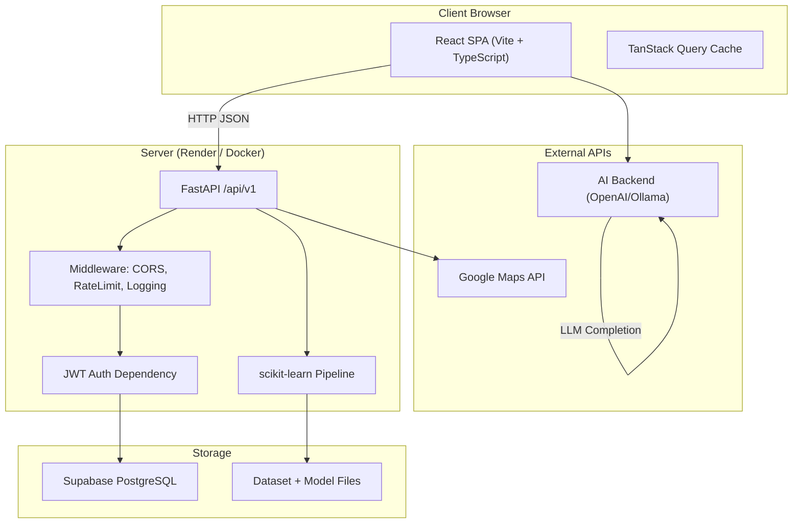
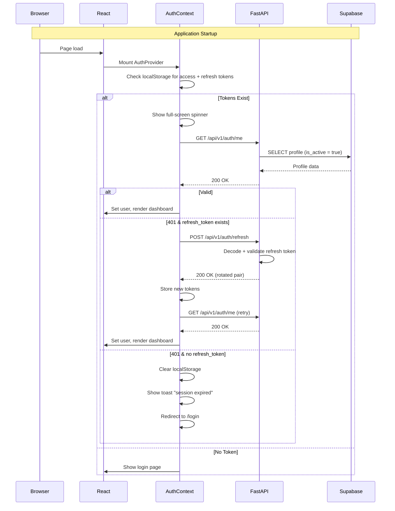
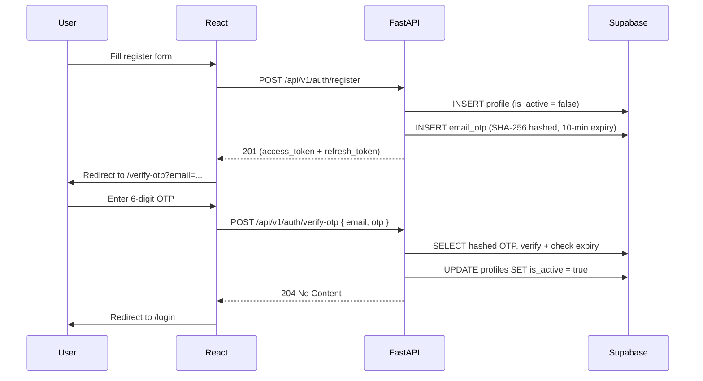
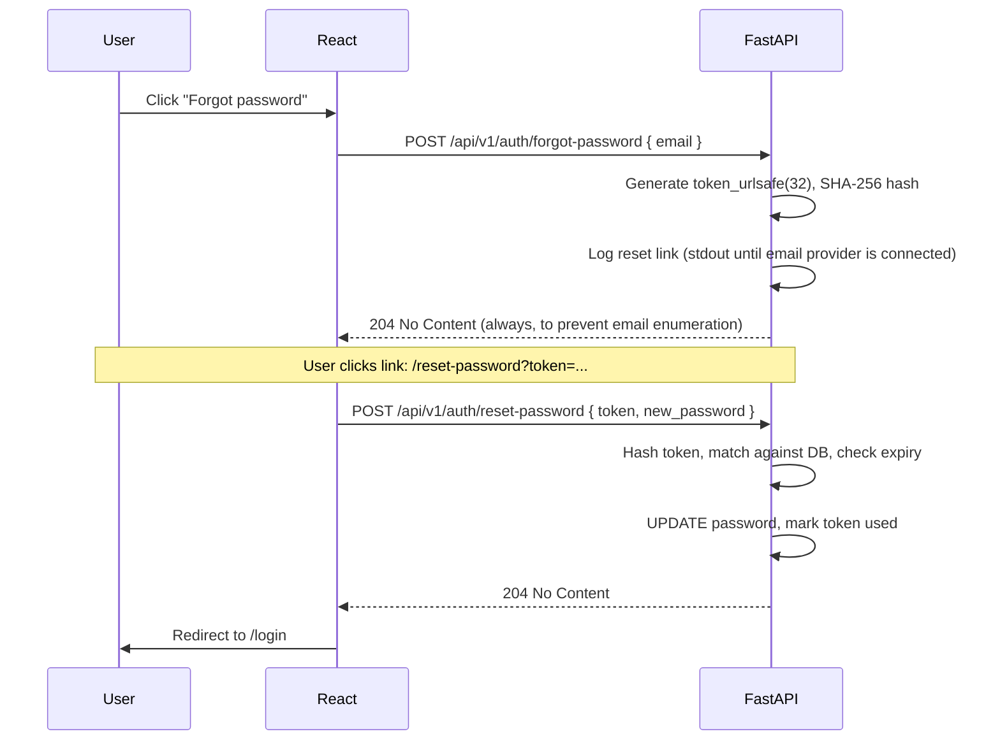
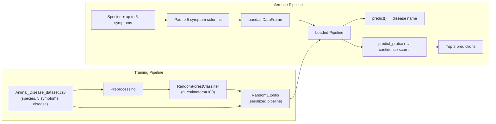
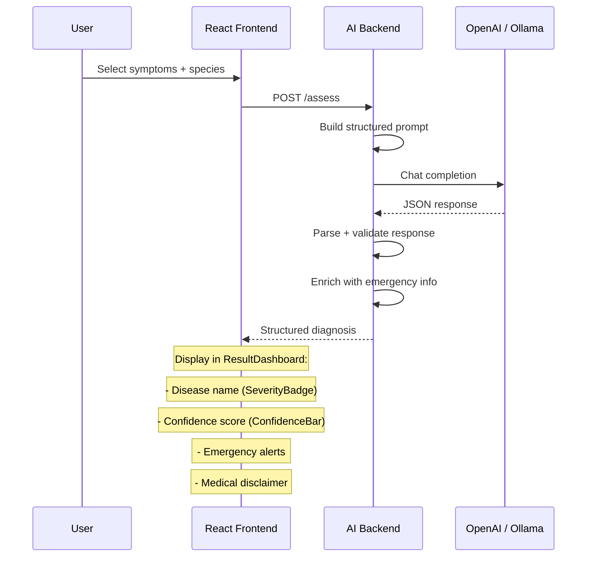
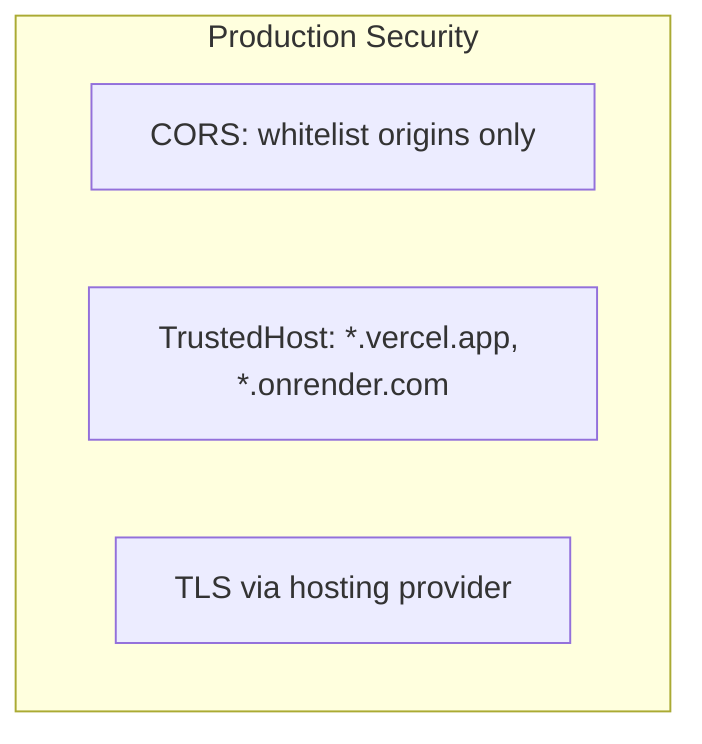

# VetiCare

> AI-powered pet healthcare platform — disease prediction, vaccination tracking, and veterinary services locator.

<div align="center">


<br />


<br />

[**Live Demo**](#) &nbsp;&bull;&nbsp; [**API Docs**](#) &nbsp;&bull;&nbsp; [**Documentation**](docs/)

</div>

---

## Table of Contents

- [Overview](#overview)
- [Problem Statement](#problem-statement)
- [Solution](#solution)
- [Key Features](#key-features)
- [Tech Stack](#tech-stack)
- [System Architecture](#system-architecture)
- [Project Structure](#project-structure)
- [Authentication Flow](#authentication-flow)
- [Quick Start](#quick-start)
- [Environment Variables](#environment-variables)
- [API Reference](#api-reference)
- [Machine Learning](#machine-learning)
- [AI Assistant](#ai-assistant)
- [Security](#security)
- [Performance](#performance)
- [Screenshots](#screenshots)
- [Roadmap](#roadmap)
- [Contributing](#contributing)
- [License](#license)

---

## Overview

VetiCare is a full-stack, production-grade pet healthcare platform that combines **machine learning disease prediction**, an **LLM-powered AI veterinary assistant**, **vaccination tracking**, and a **veterinary services locator** — all in one unified application.

Built with a **React + TypeScript** frontend and a **FastAPI** backend connected to **Supabase (PostgreSQL)**, VetiCare demonstrates modern full-stack architecture with authentication, authorization, caching, animation systems, and external API integrations.

---

## Problem Statement

Pet owners face three critical challenges:

1. **Uncertainty about symptoms**: When a pet shows symptoms, owners struggle to assess urgency and potential causes.
2. **Disorganized medical records**: Vaccination schedules, medical history, and pet records are scattered across paper files, clinic systems, and memory.
3. **Finding emergency care**: During a health crisis, locating a nearby available veterinarian quickly is difficult.

---

## Solution

VetiCare addresses these challenges with an integrated platform:

| Challenge | Solution |
|-----------|----------|
| Symptom uncertainty | ML-powered disease prediction with confidence scoring + LLM-based AI assistant for natural symptom description |
| Disorganized records | Centralized pet profiles with vaccination tracking, medical history, and prediction history |
| Finding care | Interactive map with Google Maps integration, showing nearby veterinary clinics and emergency hospitals |

---

## Key Features

### Disease Prediction
- Select animal species and up to 5 symptoms
- **Random Forest classifier** trained on a curated disease-symptom dataset
- Top 5 disease predictions with confidence percentages
- Visual confidence bar with color coding (red / amber / emerald)
- Prediction history stored per user

### AI Veterinary Assistant
- Natural language symptom description via an intuitive symptom selector
- **OpenAI-compatible LLM** (configurable: OpenAI, Ollama, or any proxy)
- Structured diagnosis with disease name, confidence, and severity
- Emergency alerts for critical conditions (poisoning, trauma, bloat)
- Medical disclaimer for responsible use

### Pet Management
- Full CRUD for pet profiles (species, breed, DOB, weight, microchip, etc.)
- Multi-pet support per user account
- Photo profile support

### Vaccination Tracking
- Record vaccinations with dates, batch numbers, and administering vet
- Next due date tracking
- Per-pet vaccination history timeline

### Interactive Map
- **Leaflet** + **OpenStreetMap** integration
- Google Maps Places API for finding nearby vets
- Works with user's current location

### Authentication
- JWT-based stateless authentication with **refresh token rotation** (7-day refresh, rotated on use)
- Email **OTP verification** on registration (6-digit code, 10-min expiry)
- **Password reset** flow with expiring tokens (30-min expiry, SHA-256 hashed)
- Session restoration on app startup with auto-refresh on 401
- Global 401 handling with silent token refresh and automatic logout on failure
- Route protection (guest vs. authenticated)

---

## Tech Stack

### Frontend

| Technology | Version | Purpose |
|------------|---------|---------|
| React | 18.3 | UI library |
| TypeScript | 5.5 | Type safety |
| Vite | 5.4 | Build tool / dev server |
| React Router | 6.24 | Client-side routing |
| TanStack Query | 5.101 | Server state management |
| Tailwind CSS | 3.4 | Styling |
| Lucide React | 0.407 | Icon library |
| Leaflet | 1.9 | Map rendering |
| Sonner | 2.0 | Toast notifications |

### Backend

| Technology | Version | Purpose |
|------------|---------|---------|
| Python | 3.11+ | Runtime |
| FastAPI | 0.115 | Web framework |
| Supabase | 2.0 | Database client |
| SQLAlchemy | - | ORM (via Supabase) |
| python-jose | 3.3 | JWT creation/validation |
| passlib | 1.7 | Password hashing (bcrypt) |
| scikit-learn | 1.5 | ML pipeline |
| pandas | 2.0 | Data manipulation |
| joblib | 1.4 | Model serialization |
| httpx | 0.27 | HTTP client |
| Logfire | - | Structured logging |

### Database

| Technology | Purpose |
|------------|---------|
| Supabase (PostgreSQL) | Primary database |
| Row-level security | Data isolation |
| UUID primary keys | Distributed ID generation |

### DevOps

| Tool | Purpose |
|------|---------|
| Vercel | Frontend hosting |
| Render | Backend hosting |
| Docker | Containerization |
| GitHub Actions | CI/CD |

---

## System Architecture



---

## Project Structure

```
veticare/
├── frontend/                          # React SPA
│   ├── src/
│   │   ├── components/
│   │   │   ├── ai-assistant/          # AI chat UI components
│   │   │   ├── animal/                # Animal reference components
│   │   │   ├── auth/                  # RouteGuards, AuthCard
│   │   │   ├── layout/                # Navbar, Footer, Section
│   │   │   ├── map/                   # LocationSearch, MapView
│   │   │   └── ui/                    # Button, Card, Badge, motion...
│   │   ├── context/
│   │   │   └── AuthContext.tsx         # Auth state management
│   │   ├── hooks/                     # useReducedMotion, useMountAnimation
│   │   ├── lib/                       # api.ts, utils.ts, constants.ts
│   │   ├── pages/                     # 24 route page components
│   │   ├── services/                  # auth.ts, services.ts
│   │   ├── App.tsx                    # Router + providers
│   │   └── main.tsx                   # Entry point
│   ├── index.html
│   ├── vite.config.ts
│   └── tailwind.config.js
│
├── backend/                           # FastAPI (main veticare project)
│   ├── app/
│   │   ├── api/
│   │   │   ├── routes/               # 12 route modules
│   │   │   ├── dependencies.py        # FastAPI dependencies
│   │   │   └── router.py             # Central router
│   │   ├── core/                      # Config, ML model, rate limit...
│   │   ├── models/                    # Domain models
│   │   ├── schemas/                   # Pydantic request/response
│   │   ├── services/                  # Business logic
│   │   └── utils/                     # Security (JWT, bcrypt)
│   ├── dataset/                       # CSV dataset + .joblib model
│   ├── tests/                         # pytest tests
│   ├── alembic.ini
│   └── supabase_migration.sql         # DB schema
│
├── backend/ (root)                    # AI Assistant service
│   ├── app/
│   │   ├── api/routes/ai_assistant.py
│   │   ├── schemas/schemas.py
│   │   └── services/                  # LLM, prompt builder, knowledge
│   └── data/diseases.json
│
├── dataset/                           # ML training notebook + data
├── docs/                              # Documentation
├── screenshots/                       # App screenshots
├── docker-compose.yml
├── Dockerfile
└── generate_pdf.py                    # Documentation PDF generator
```

---

## Authentication Flow

### Session Startup & Auto-Refresh



### Registration & OTP Verification



### Password Reset



---

## Quick Start

### Prerequisites

- Python 3.11+
- Node.js 20+
- Supabase account (free tier)
- A package manager (npm / pip)

### 1. Clone

```bash
git clone https://github.com/your-username/veticare.git
cd veticare/veticare
```

### 2. Backend Setup

```bash
cd backend

# Create virtual environment
python -m venv .venv
source .venv/bin/activate  # Windows: .venv\Scripts\activate

# Install dependencies
pip install -r requirements.txt

# Configure environment
cp .env.example .env
# Edit .env with your Supabase credentials

# Run database migrations (in Supabase SQL editor)
# Execute supabase_migration.sql

# Start server
uvicorn app.main:app --reload
```

### 3. Frontend Setup

```bash
cd frontend

# Install dependencies
npm install

# Configure environment
cp .env.example .env
# Edit .env with API URL (default: http://localhost:8000)

# Start dev server
npm run dev
```

### 4. Open

```
Frontend: http://localhost:5173
Backend API: http://localhost:8000
API Docs: http://localhost:8000/docs
```

---

## Environment Variables

### Frontend (`frontend/.env`)

| Variable | Required | Default | Description |
|----------|----------|---------|-------------|
| `VITE_API_URL` | Yes | `http://localhost:8000` | Backend API base URL |
| `VITE_AI_API_URL` | Yes | `http://localhost:8000` | AI Assistant backend URL |

### Backend (`backend/.env`)

| Variable | Required | Default | Description |
|----------|----------|---------|-------------|
| `VETICARE_SUPABASE_URL` | Yes | — | Supabase project URL |
| `VETICARE_SUPABASE_KEY` | Yes | — | Supabase service_role key |
| `JWT_SECRET_KEY` | Yes* | `development-only-change-me` | JWT signing secret |
| `ENVIRONMENT` | No | `development` | `development`, `test`, or `production` |
| `DEBUG` | No | `false` | Enable debug mode |
| `CORS_ORIGINS` | No | `["http://localhost:5173"]` | Allowed CORS origins |

*\* Required in production. Must be a secure random string.*

---

## API Reference

### System

| Method | Route | Description | Auth |
|--------|-------|-------------|------|
| GET | `/health` | Health check (DB + model status) | No |
| GET | `/api/v1/status` | API status | No |

### Authentication

| Method | Route | Description | Auth |
|--------|-------|-------------|------|
| POST | `/api/v1/auth/register` | Create account (returns access + refresh token, sends OTP) | No |
| POST | `/api/v1/auth/login` | Sign in (returns access + refresh token) | No |
| POST | `/api/v1/auth/token` | OAuth2 token (Swagger) | No |
| POST | `/api/v1/auth/refresh` | Rotate refresh token → new access + refresh pair | No |
| POST | `/api/v1/auth/verify-otp` | Verify email OTP and activate account | No |
| POST | `/api/v1/auth/forgot-password` | Request password reset link (always 204) | No |
| POST | `/api/v1/auth/reset-password` | Reset password using token from email | No |
| GET | `/api/v1/auth/me` | Current user profile | Yes |

### Pets

| Method | Route | Description | Auth |
|--------|-------|-------------|------|
| GET | `/api/v1/pets` | List user's pets | Yes |
| POST | `/api/v1/pets` | Create pet | Yes |
| GET | `/api/v1/pets/{id}` | Get pet details | Yes |
| PATCH | `/api/v1/pets/{id}` | Update pet | Yes |
| DELETE | `/api/v1/pets/{id}` | Delete pet | Yes |

### Vaccinations

| Method | Route | Description | Auth |
|--------|-------|-------------|------|
| GET | `/api/v1/vaccinations/pet/{id}` | List pet's vaccinations | Yes |
| POST | `/api/v1/vaccinations` | Add vaccination | Yes |
| PATCH | `/api/v1/vaccinations/{id}` | Update vaccination | Yes |
| DELETE | `/api/v1/vaccinations/{id}` | Delete vaccination | Yes |

### ML & Prediction

| Method | Route | Description | Auth |
|--------|-------|-------------|------|
| GET | `/api/v1/ml/species` | List supported species | Yes |
| GET | `/api/v1/ml/symptoms?species=Dog` | List species symptoms | Yes |
| POST | `/api/v1/prediction` | Run disease prediction | Yes |
| GET | `/api/v1/prediction/history` | Prediction history | Yes |

### Reference Data

| Method | Route | Description | Auth |
|--------|-------|-------------|------|
| GET | `/api/v1/animals` | List animal species | Yes |
| GET | `/api/v1/animals/{id}` | Species details | Yes |
| GET | `/api/v1/animals/{id}/diseases` | Species diseases | Yes |
| GET | `/api/v1/care-guides` | Browse care guides | Yes |

### Services

| Method | Route | Description | Auth |
|--------|-------|-------------|------|
| GET | `/api/v1/nearby-services?lat=...&lng=...` | Find nearby vets | Yes |
| POST | `/api/v1/contact` | Contact form | No |

---

## Machine Learning

### Model Architecture



### Dataset
- **File**: `dataset/Animal_Disease_dataset.csv`
- **Columns**: `AnimalName`, `symptoms1`–`symptoms5`, `DiseaseName`
- **Species**: Dog, Cat, Horse, Rabbit, Bird, Fish, Cattle
- **Training notebook**: `dataset/Animal_Disease_prediction.ipynb`

### Prediction Output

```json
{
  "disease": "Canine Distemper",
  "confidence": 0.8745,
  "top_predictions": [
    { "disease": "Canine Distemper", "confidence": 0.8745 },
    { "disease": "Kennel Cough", "confidence": 0.0821 },
    { "disease": "Canine Parvovirus", "confidence": 0.0293 },
    { "disease": "Canine Influenza", "confidence": 0.0078 },
    { "disease": "Bronchitis", "confidence": 0.0063 }
  ]
}
```

---

## AI Assistant

### Architecture



- **Endpoint**: Configurable (default `http://localhost:8000`)
- **Prompt**: Structured with context about species, symptoms, and severity criteria
- **Response**: Parsed JSON with disease, confidence, severity, recommendations, and emergency flag
- **Safety**: Always displays a medical disclaimer

---

## Security

### Implemented Measures

| Measure | Implementation |
|---------|---------------|
| **Password hashing** | bcrypt with salt via `passlib` |
| **JWT access tokens** | HS256, 30-minute expiry |
| **JWT refresh tokens** | HS256, 7-day expiry, rotated on every use |
| **Email OTP verification** | 6-digit code, SHA-256 hashed, 10-min expiry, single-use |
| **Password reset tokens** | `secrets.token_urlsafe(32)`, SHA-256 hashed, 30-min expiry, single-use |
| **Production secret validation** | Startup check rejects development defaults |
| **Input validation** | Pydantic v2 schemas on all endpoints |
| **CORS whitelist** | Only configured origins allowed |
| **Rate limiting** | Token-bucket per IP |
| **Ownership validation** | Every resource query checks user ownership |
| **Global error handler** | Sanitized 500 responses with trace_id |
| **Password masking** | Request logs mask password fields |
| **Secrets management** | All secrets via environment variables |
| **Email enumeration protection** | Forgot-password endpoint always returns 204 |

### Security Headers



---

## Performance

### Frontend

- **Code splitting**: All 24 pages are lazy-loaded
- **Skeleton loading**: Placeholder UI during chunk loading
- **GPU animations**: Only `transform` and `opacity` animated
- **Reduced motion**: Full support for `prefers-reduced-motion`
- **TanStack Query**: 30-second stale time, 1 retry
- **Production build**: ~102KB JS gzipped, ~15KB CSS gzipped

### Backend

- **In-process ML inference**: No network calls for predictions
- **Startup model loading**: Model loaded once into app state
- **Indexed queries**: All DB queries on indexed columns
- **Pagination**: Range-based pagination for list endpoints
- **Rate limiting**: Prevents abuse at the middleware level

---

## Screenshots

<div align="center">
  <table>
    <tr>
      <td></td>
      <td></td>
    </tr>
    <tr>
      <td align="center"><b>Home Page</b></td>
      <td align="center"><b>Dashboard</b></td>
    </tr>
    <tr>
      <td></td>
      <td></td>
    </tr>
    <tr>
      <td align="center"><b>Disease Prediction</b></td>
      <td align="center"><b>AI Assistant</b></td>
    </tr>
  </table>
</div>

---

## Roadmap

### v1.0 — Current
- [x] JWT authentication with session restoration
- [x] Refresh token rotation (auto-refresh on 401)
- [x] Email OTP verification on registration
- [x] Password reset flow (forgot / reset endpoints)
- [x] ML disease prediction
- [x] AI veterinary assistant
- [x] Pet & vaccination CRUD
- [x] Nearby veterinary services map
- [x] Care guides & animal encyclopedia
- [x] Responsive UI with animations

### v1.1 — Next
- [ ] Email provider integration (Resend / SES) for actual OTP & password reset delivery
- [ ] Dark mode
- [ ] Improved test coverage
- [ ] httpOnly cookie-based token storage

### v1.2 — Future
- [ ] PWA / offline support
- [ ] Push notifications for vaccination reminders
- [ ] Multi-language support
- [ ] Admin dashboard
- [ ] Data export (PDF / CSV)

---

## Contributing

1. Fork the repository
2. Create a feature branch (`git checkout -b feature/amazing-feature`)
3. Commit your changes (`git commit -m 'Add amazing feature'`)
4. Push to the branch (`git push origin feature/amazing-feature`)
5. Open a Pull Request

Please ensure your code passes the existing tests and linting:

```bash
# Backend
cd backend && pytest && ruff check .

# Frontend
cd frontend && npm run lint && npm run build
```

---

## License

This project is licensed under the MIT License. See `LICENSE` for details.

---

## Contact

- **GitHub**: [@your-username](https://github.com/your-username)
- **Email**: your-email@example.com
- **Project Link**: [https://github.com/your-username/veticare](https://github.com/your-username/veticare)

---

<div align="center">
  <sub>Built with care for pets and their humans.</sub>
</div>
