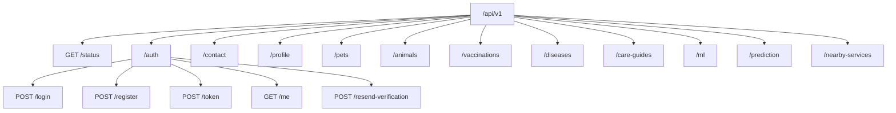
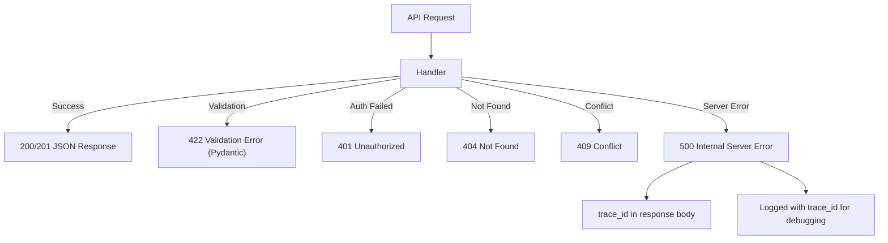

# VetiCare API Documentation

## Overview

The VetiCare API is a **RESTful JSON API** built with **FastAPI**. All endpoints are prefixed with `/api/v1`. The API serves both the React frontend and potential third-party integrations. Interactive documentation is available at `/docs` (Swagger UI) and `/redoc` (ReDoc).

---

## Base URL

| Environment | URL |
|-------------|-----|
| Development | `http://localhost:8000` |
| Production | `https://veticare-backend.onrender.com` |

---

## API Router Architecture



---

## Authentication

All endpoints except `/auth/*`, `/contact`, `/status`, and `/health` require a valid JWT bearer token.

### Header Format

```
Authorization: Bearer <access_token>
```

### Token Lifecycle

- **Issued at**: Login or Registration
- **Expiry**: 30 minutes (configurable via `ACCESS_TOKEN_EXPIRE_MINUTES`)
- **Algorithm**: HS256
- **Storage**: `localStorage` as `veticare_token` (JSON with `access_token` key)

---

## Endpoint Reference

### System

#### `GET /health`

Health check endpoint. Returns API status, database connectivity, and ML model availability.

**Authentication**: None

**Response**:
```json
{
  "status": "ok",
  "version": "1.0.0",
  "database": "connected",
  "supabase": "connected",
  "model": "loaded"
}
```

#### `GET /api/v1/status`

API status with environment info.

**Authentication**: None

---

### Authentication (`/auth`)

#### `POST /api/v1/auth/register`

Create a new user account.

**Authentication**: None

**Request**:
```json
{
  "email": "user@example.com",
  "password": "securePassword123",
  "full_name": "John Doe",
  "phone": "+1234567890"
}
```

**Response** (201):
```json
{
  "access_token": "eyJhbGciOiJIUzI1NiIs...",
  "token_type": "bearer"
}
```

**Validation**:
- Email must be valid format
- Password minimum 8 characters
- Email must not already be registered (409 Conflict)

#### `POST /api/v1/auth/login`

Authenticate with email and password.

**Authentication**: None

**Request**:
```json
{
  "email": "user@example.com",
  "password": "securePassword123"
}
```

**Response**:
```json
{
  "access_token": "eyJhbGciOiJIUzI1NiIs...",
  "token_type": "bearer"
}
```

**Errors**:
- 401: Incorrect email or password

#### `POST /api/v1/auth/token`

OAuth2-compatible form login (for Swagger UI authorization).

**Authentication**: None

**Request**: Form data with `username` and `password` fields.

#### `GET /api/v1/auth/me`

Return the currently authenticated user's profile.

**Authentication**: Required

**Response**:
```json
{
  "id": "uuid",
  "email": "user@example.com",
  "full_name": "John Doe",
  "phone": "+1234567890",
  "role": "user",
  "is_active": true,
  "created_at": "2024-01-01T00:00:00Z"
}
```

---

### Profile (`/profile`)

#### `GET /api/v1/profile/{profile_id}`

Get a specific profile by ID.

#### `PATCH /api/v1/profile/{profile_id}`

Update profile fields (name, phone).

#### `PUT /api/v1/profile/password`

Change account password. Requires current password verification.

---

### Pets (`/pets`)

#### `GET /api/v1/pets`

List all pets for the authenticated user.

#### `POST /api/v1/pets`

Create a new pet record.

**Request**:
```json
{
  "name": "Buddy",
  "species": "Dog",
  "breed": "Golden Retriever",
  "color": "Golden",
  "date_of_birth": "2020-03-15",
  "weight_kg": 30.5,
  "gender": "Male",
  "is_neutered": true,
  "microchip_id": "985112003456789"
}
```

#### `GET /api/v1/pets/{pet_id}`

Get a single pet by ID. Validates ownership.

#### `PATCH /api/v1/pets/{pet_id}`

Update pet details.

#### `DELETE /api/v1/pets/{pet_id}`

Delete a pet record.

---

### Vaccinations (`/vaccinations`)

#### `GET /api/v1/vaccinations/pet/{pet_id}`

List all vaccinations for a pet.

#### `POST /api/v1/vaccinations`

Add a vaccination record.

#### `PATCH /api/v1/vaccinations/{vaccination_id}`

Update a vaccination entry.

#### `DELETE /api/v1/vaccinations/{vaccination_id}`

Delete a vaccination record.

---

### ML & Prediction (`/ml`, `/prediction`)

#### `GET /api/v1/ml/species`

Get list of supported animal species for disease prediction.

#### `GET /api/v1/ml/symptoms?species=Dog`

Get symptoms available for a given species.

#### `POST /api/v1/prediction`

Run disease prediction on symptom input.

**Request**:
```json
{
  "pet_id": "uuid",
  "species": "Dog",
  "symptoms": ["Fever", "Cough", "Lethargy"]
}
```

**Response**:
```json
{
  "disease": "Canine Distemper",
  "confidence": 0.8745,
  "top_predictions": [
    {"disease": "Canine Distemper", "confidence": 0.8745},
    {"disease": "Kennel Cough", "confidence": 0.0821},
    {"disease": "Canine Parvovirus", "confidence": 0.0293}
  ]
}
```

#### `GET /api/v1/prediction/history`

Get prediction history for the authenticated user.

---

### Animals (`/animals`)

Reference data for animal species, diseases, and care guides.

| Method | Endpoint | Description |
|--------|----------|-------------|
| GET | `/animals` | List all species |
| GET | `/animals/{id}` | Get species details |
| GET | `/animals/{id}/diseases` | List diseases for species |
| GET | `/animals/{id}/care-guides` | List care guides |

---

### Nearby Services (`/nearby-services`)

#### `GET /api/v1/nearby-services?lat=...&lng=...&radius=5000`

Find veterinary clinics and pet services near a location.

**Parameters**: `lat`, `lng`, `radius` (meters), `type` (vet/clinic/hospital)

---

### Contact (`/contact`)

#### `POST /api/v1/contact`

Submit a contact form message.

**Authentication**: None

**Request**:
```json
{
  "name": "John Doe",
  "email": "john@example.com",
  "subject": "General Inquiry",
  "message": "I have a question about..."
}
```

---

### Debug Endpoints (development only)

| Method | Endpoint | Description |
|--------|----------|-------------|
| GET | `/debug/supabase` | Supabase connection test |
| GET | `/debug/env` | Environment variable status |

---

## API Validation

All request bodies are validated using **Pydantic v2** schemas. Invalid requests receive a 422 response with field-level error details:

```json
{
  "detail": [
    {
      "loc": ["body", "email"],
      "msg": "value is not a valid email address",
      "type": "value_error.email"
    }
  ]
}
```

---

## Error Handling



Global exception handler:
- Catches all unhandled exceptions
- Generates a `trace_id` (UUID v4)
- Returns `{"success": false, "message": "Internal server error", "trace_id": "..."}`
- Logs the full traceback with `trace_id` for correlation
