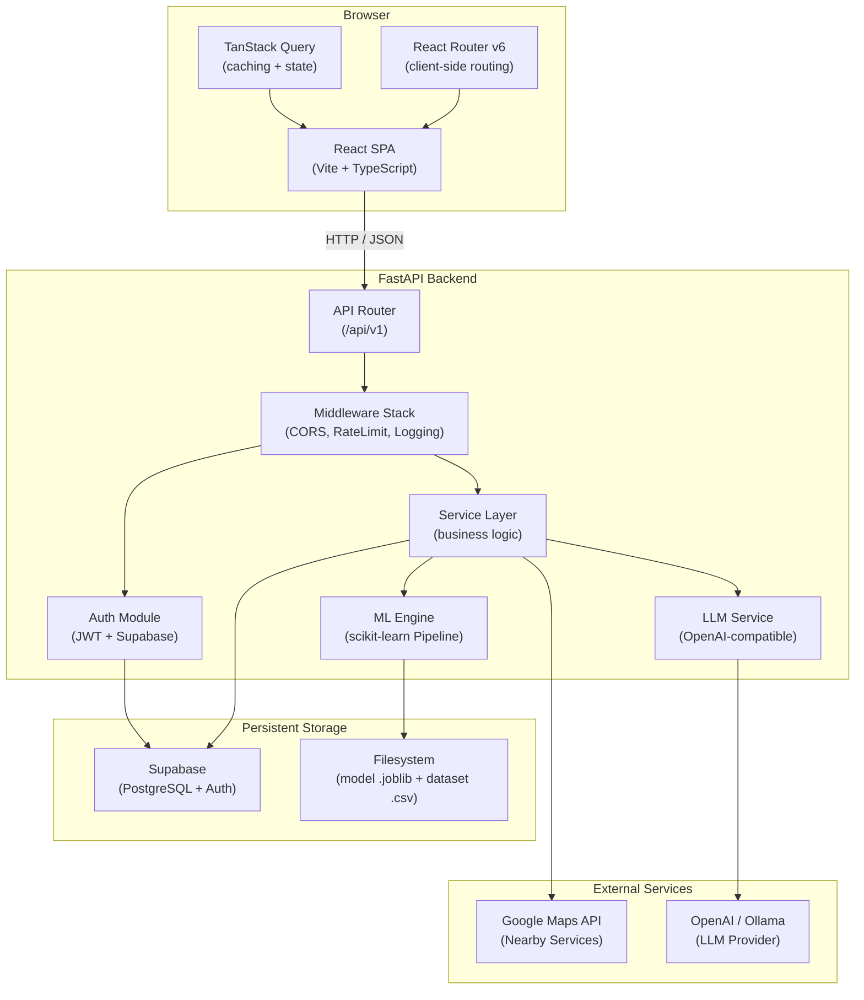
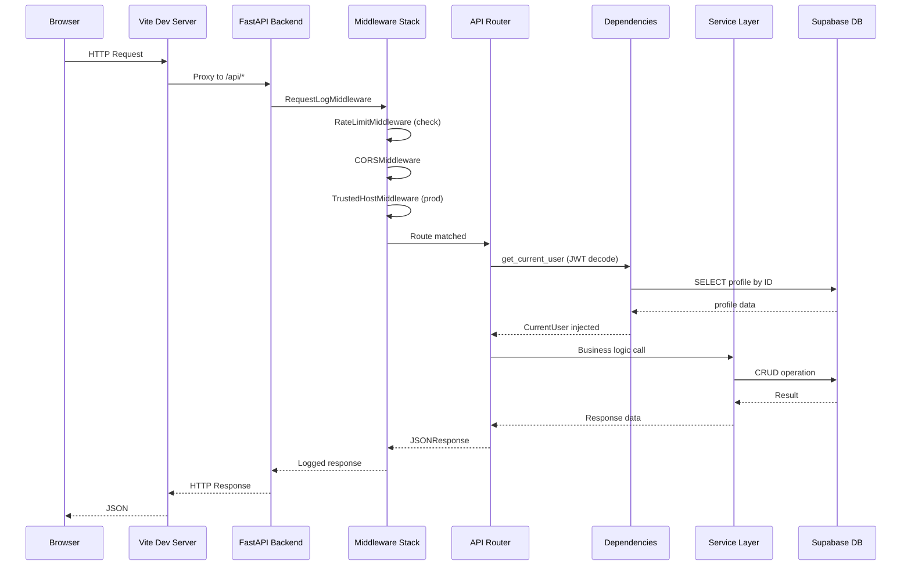
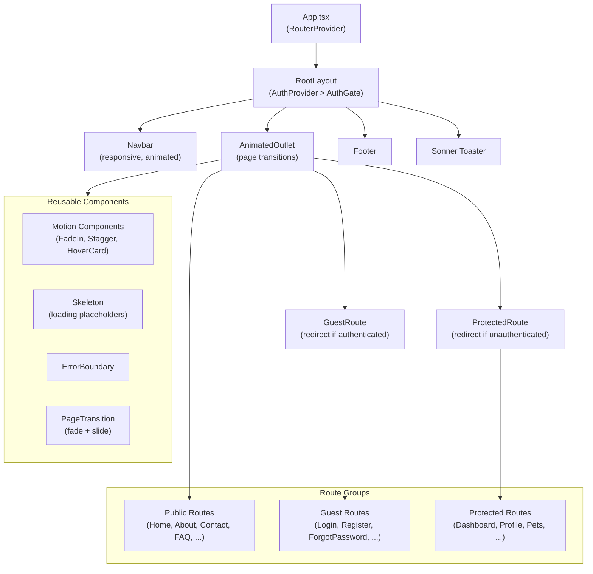
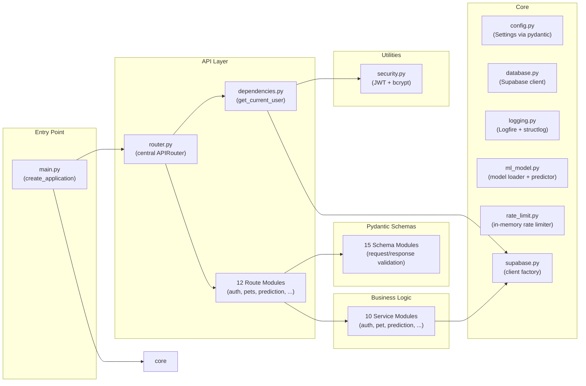
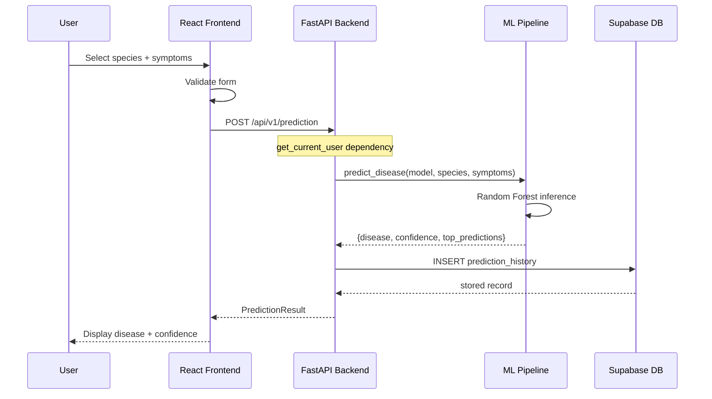
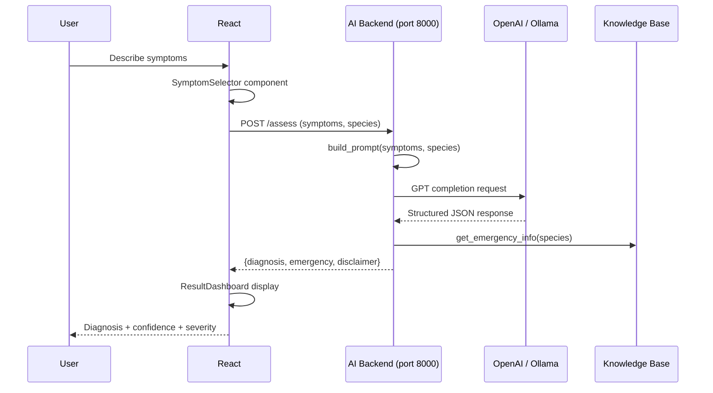
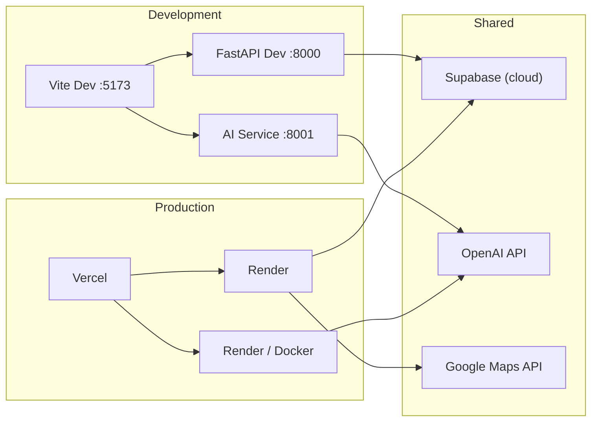

# VetiCare Architecture

## Overview

VetiCare is a full-stack pet healthcare platform built with a **React** frontend and a **FastAPI** backend, connected via a **Supabase** PostgreSQL database. The platform integrates machine learning for disease prediction and a Large Language Model (LLM) for an AI-powered veterinary assistant.

---

## System Architecture Diagram



---

## Layer Architecture

```mermaid
graph LR
    subgraph Presentation["Presentation Layer"]
        Pages["Pages<br/>(24 route pages)"]
        Layout["Layout Components<br/>(Navbar, Footer)"]
        UI["UI Primitives<br/>(Button, Card, Badge)"]
        Motion["Animation Components<br/>(FadeIn, Stagger, HoverCard)"]
    end

    subgraph State["State & Context"]
        AuthCtx["AuthContext<br/>(user, session, login/logout)"]
        RQClient["TanStack Query<br/>(server state cache)"]
    end

    subgraph Services["Service Layer"]
        AuthSvc["authService<br/>(token mgmt, /auth/me)"]
        ApiClient["api.ts<br/>(fetch wrapper, 401 interceptor)"]
        Services["services.ts<br/>(pet, vaccination, prediction)"]
    end

    subgraph API["Backend API"]
        Router["Central Router<br/>(12 route modules)"]
        Deps["Dependencies<br/>(auth, supabase client)"]
    end

    subgraph Business["Business Logic"]
        ServicesB["Service Modules<br/>(auth, pet, prediction, ...)"]
        ML["ML Pipeline<br/>(Random Forest Classifier)"]
        LLM["LLM Service<br/>(prompt + completion)"]
    end

    subgraph DB["Database"]
        SB["Supabase<br/>(PostgreSQL)"]
    end

    Presentation --> State
    State --> Services
    Services --> API
    API --> Deps
    Deps --> Business
    Business --> DB
    ML --> Dataset["CSV Dataset<br/>(training data)"]
    LLM --> OpenAI["OpenAI / Ollama"]
```

---

## Request Lifecycle



---

## Frontend Component Hierarchy



---

## Backend Module Dependency Graph



---

## Key Architectural Decisions

### 1. JWT + External Auth Provider

Authentication uses a dual-layer approach: **bcrypt password hashing** for local credential storage in Supabase, and **JWT tokens** (HS256, 30-minute expiry) for stateless API authorization. The `python-jose` library handles token creation and validation. This avoids session storage on the server and enables horizontal scaling.

### 2. Supabase as Database Backend

Supabase provides a PostgreSQL-compatible database with row-level security via the `service_role` key. The backend uses the Supabase Python client (`supabase-py`) for all CRUD operations. A Supabase migration script (`supabase_migration.sql`) defines the schema.

### 3. Scikit-learn Pipeline

The ML model is a `RandomForestClassifier` trained on a CSV dataset of animal-disease-symptom mappings. The model is serialized via `joblib` and loaded at application startup. Predictions run entirely in-process — no external ML service required.

### 4. LLM Integration

The AI Assistant feature uses a separate FastAPI service (`backend/app/`) with OpenAI-compatible API calls (configurable endpoint). The prompt builder constructs structured prompts from symptom input, and the LLM response is parsed into a JSON result with disease name, confidence, and severity.

### 5. Frontend State Architecture

Three state layers:
- **AuthContext**: React Context for authentication state (user, token, session restoration)
- **TanStack Query**: Server state cache for all API data (pets, vaccinations, predictions)
- **URL state**: React Router v6 for navigation state (route params, query strings)

### 6. Animation Infrastructure

All animations use only `transform` and `opacity` for GPU-accelerated performance. A custom `useReducedMotion` hook respects the user's `prefers-reduced-motion` setting. Durations are constrained to 180-300ms range.

---

## Data Flow: Disease Prediction



---

## Data Flow: AI Assistant



---

## Environment Separation


