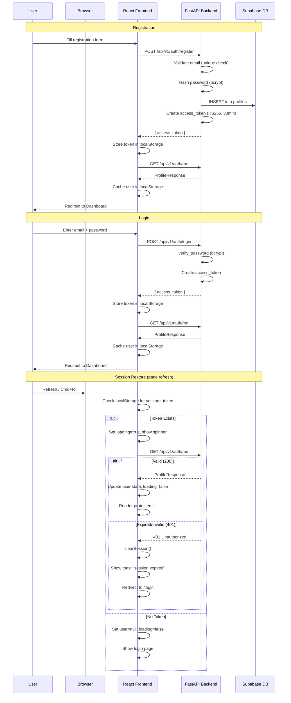
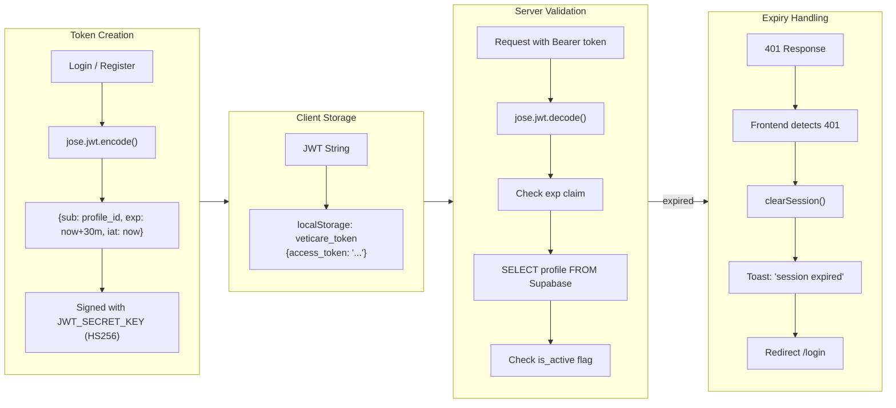
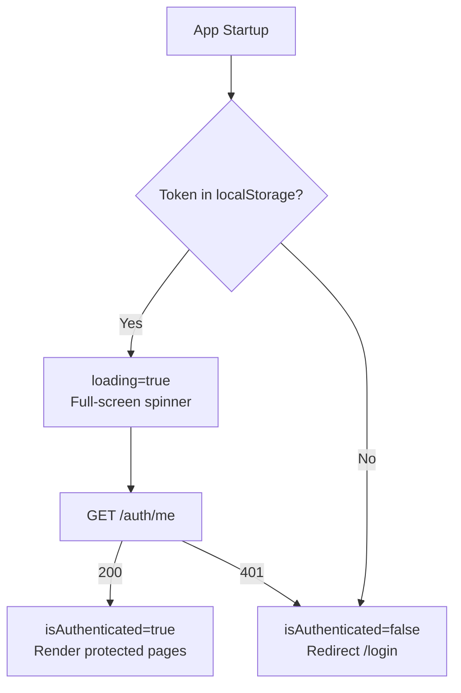

# VetiCare Authentication Flow

## Overview

VetiCare implements a **stateless JWT authentication** system. The backend issues signed tokens on login/registration, and the frontend validates sessions on every application startup by calling `/auth/me`. The backend is the **single source of truth** for authentication state.

---

## Authentication Flow Diagram



---

## Token Lifecycle



---

## Frontend Auth Implementation

### AuthContext (`src/context/AuthContext.tsx`)

The `AuthProvider` component:

1. **Initialization**: Checks `localStorage` for `veticare_token`. If present, sets `loading=true` and calls `restoreSession()`.
2. **Session Validation**: Calls `GET /api/v1/auth/me`. On success, populates user state. On 401, clears everything and redirects.
3. **401 Interceptor**: Registers a global handler with `api.ts` via `setOnUnauthorized()`. Any API 401 response triggers session cleanup, toast, and redirect.
4. **Exposed API**: `user`, `loading`, `isAuthenticated`, `login()`, `register()`, `logout()`, `restoreSession()`, `refreshUser()`

### Route Protection



### Global 401 Interceptor

In `src/lib/api.ts`:

```typescript
// Registered on every API call
if (res.status === 401) onUnauthorized?.();

// AuthContext registers its handler:
setOnUnauthorized(() => {
  authService.clearSession();
  setUser(null);
  toast.error("Your session has expired. Please sign in again.");
  navigate("/login");
});
```

---

## Backend Auth Implementation

### Password Hashing

Uses **bcrypt** via the `passlib` library:

```python
from passlib.context import CryptContext

pwd_context = CryptContext(schemes=["bcrypt"], deprecated="auto")

def hash_password(password: str) -> str:
    return pwd_context.hash(password)

def verify_password(password: str, hashed: str) -> bool:
    return pwd_context.verify(password, hashed)
```

### JWT Tokens

Created and validated with `python-jose`:

```python
# Creation
def create_access_token(subject: str) -> str:
    expires = datetime.now(UTC) + timedelta(minutes=30)
    return jwt.encode(
        {"sub": subject, "exp": expires, "iat": datetime.now(UTC)},
        settings.jwt_secret_key,
        algorithm="HS256",
    )

# Validation
def decode_access_token(token: str) -> str:
    payload = jwt.decode(token, settings.jwt_secret_key, algorithms=["HS256"])
    return payload["sub"]  # profile_id
```

### Session Validation Dependency

```python
def get_current_user(token: Annotated[str, Depends(oauth2_scheme)],
                     supabase: SupabaseClient) -> dict:
    profile_id = decode_access_token(token)
    result = supabase.table("profiles").select("*")\
        .eq("id", profile_id).execute()
    if not result.data or not result.data[0].get("is_active"):
        raise HTTPException(status_code=401)
    return result.data[0]
```

---

## Security Considerations

- **Passwords** are never stored in plain text; bcrypt hashing with salt
- **JWT Secret**: Must be changed from default in production (validated at startup via `model_validator`)
- **Token Expiry**: 30-minute short-lived tokens; no refresh tokens in current implementation
- **localStorage**: Token stored in `localStorage` (XSS-vulnerable). Backend validates every request.
- **Session Validation**: Every app startup calls `/auth/me` — the backend is the source of truth
- **No automatic retry**: 401 clears state immediately to prevent infinite loops
