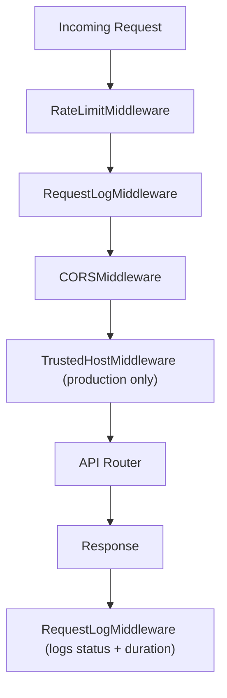
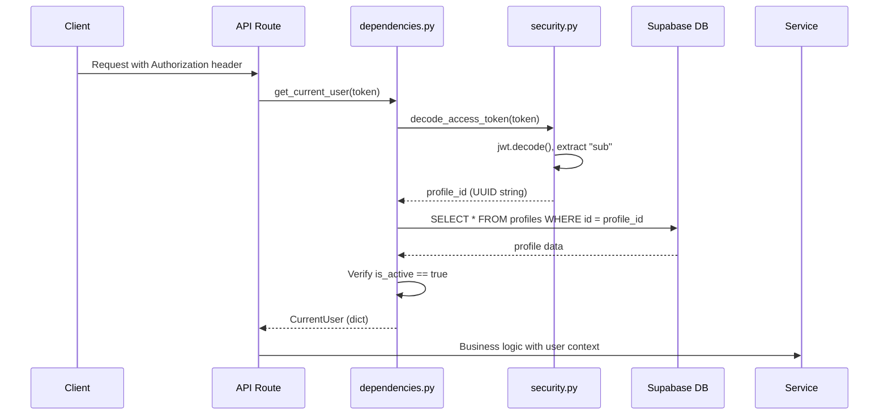
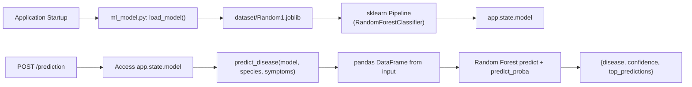
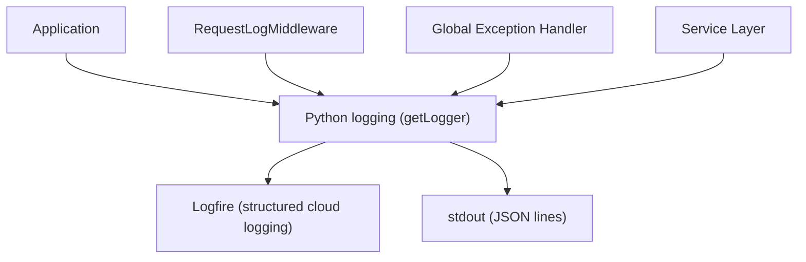

# VetiCare Backend Architecture

## Overview

The backend is a **FastAPI** application (Python 3.11+) that provides a RESTful JSON API for the VetiCare platform. It handles authentication, business logic, machine learning inference, and integration with external services.

---

## Application Entry Point

`app/main.py` defines the `create_application()` factory function that:

1. Loads settings from environment variables via `pydantic-settings`
2. Configures structured logging (Logfire + structlog)
3. Establishes Supabase database connection
4. Loads the ML model (scikit-learn pipeline) from disk
5. Registers middleware stack (CORS, rate limiting, request logging)
6. Includes all API route modules under `/api/v1`
7. Registers global exception handler with trace_id
8. Mounts health check and debug endpoints

---

## Middleware Stack

### 1. RateLimitMiddleware

In-memory token bucket rate limiter. Limits requests per client IP to prevent abuse.

- **Burstable**: permits short traffic spikes
- **Per-IP tracking**: independent limits per client
- **Configurable**: refill rate and bucket size set in middleware

### 2. RequestLogMiddleware

Logs every request with:
- HTTP method
- URL path
- Response status code
- Duration in milliseconds
- Request body (passwords masked)

### 3. CORSMiddleware

Allows requests from configured origins:
- `http://localhost:3000`, `http://localhost:5173` (development)
- `https://veticare-seven.vercel.app` (production)

### 4. TrustedHostMiddleware

Active only in production. Restricts requests to known hosts:
- `*.vercel.app`
- `*.onrender.com`

---

## Module Architecture

### Core Layer (`app/core/`)

| Module | Responsibility |
|--------|---------------|
| `config.py` | `Settings` class with pydantic-settings for env var loading |
| `database.py` | Supabase client configuration |
| `supabase.py` | `get_supabase_client()` factory with singleton |
| `ml_model.py` | ML model loader and `predict_disease()` function |
| `rate_limit.py` | Token-bucket rate limiter middleware |
| `logging.py` | Logfire + structlog integration |
| `http.py` | HTTP client helpers |

### API Layer (`app/api/`)

| Module | Responsibility |
|--------|---------------|
| `router.py` | Central `APIRouter` that aggregates all route modules |
| `dependencies.py` | FastAPI dependencies: `get_current_user`, `get_settings`, `get_supabase_client` |
| `routes/auth.py` | Login, register, OAuth2 token, current user profile |
| `routes/pet.py` | Pet CRUD |
| `routes/vaccination.py` | Vaccination history CRUD |
| `routes/prediction.py` | ML prediction + history |
| `routes/ml_model.py` | Available species and symptoms for prediction |
| `routes/animal.py` | Animal reference data (species, diseases) |
| `routes/care_guide.py` | Care guides per species |
| `routes/nearby_services.py` | Google Maps nearby search |
| `routes/profile.py` | User profile update, password change |
| `routes/contact.py` | Contact form submission |
| `routes/disease.py` | Disease reference data |

### Service Layer (`app/services/`)

| Module | Responsibility |
|--------|---------------|
| `auth.py` | `authenticate_profile()`, `register_profile()`, `get_profile_by_email()` |
| `pet.py` | Pet CRUD with ownership validation |
| `vaccination.py` | Vaccination history CRUD |
| `prediction.py` | Prediction storage and history retrieval |
| `profile.py` | Profile update and password change |
| `animal.py` | Animal reference data queries |
| `care_guide.py` | Care guide queries |
| `disease.py` | Animal disease queries |
| `nearby_services.py` | Google Maps Places API integration |
| `ml_model.py` | Model metadata service |

### Schema Layer (`app/schemas/`)

Pydantic v2 models for request/response validation:

| Module | Key Schemas |
|--------|-------------|
| `auth.py` | `LoginRequest`, `RegisterRequest`, `TokenResponse`, `ProfileResponse` |
| `pet.py` | `PetCreate`, `PetUpdate`, `PetResponse` |
| `vaccination.py` | `VaccinationCreate`, `VaccinationUpdate`, `VaccinationResponse` |
| `prediction.py` | `PredictionCreate`, `PredictionResponse` |
| `contact.py` | `ContactRequest`, `ContactResponse` |
| `common.py` | `PaginationParams`, `SuccessResponse`, `ErrorResponse` |
| `ml_model.py` | `SpeciesListResponse`, `SymptomListResponse` |
| `nearby.py` | `NearbySearchParams`, `NearbyPlaceResponse` |
| `profile.py` | `ProfileUpdateRequest`, `PasswordChangeRequest` |

### Utils Layer (`app/utils/`)

| Module | Responsibility |
|--------|---------------|
| `security.py` | `hash_password()`, `verify_password()`, `create_access_token()`, `decode_access_token()` |

---

## Authentication Dependency Chain

---

## ML Pipeline Integration

---

## External Service Integrations

### Google Maps API

The `nearby_services` module uses Google Maps Places API to find veterinary clinics and pet services near a given latitude/longitude. Results are cached and returned with distance, rating, and contact info.

### LLM Provider (AI Assistant)

The separate AI backend (`backend/app/`) at `http://localhost:8000` (configurable) communicates with OpenAI-compatible APIs (OpenAI, Ollama, or any OpenAI-proxy). It constructs structured prompts from symptom inputs and parses LLM responses into JSON.

---

## Logging Architecture

Logging is configured in `app/core/logging.py` using Logfire (structured logging service) with structlog for JSON formatting. Each log entry includes:
- Timestamp
- Module name
- Log level
- Message
- Structured context (trace_id, request_id, etc.)

---

## Configuration (Environment Variables)

| Variable | Required | Default | Description |
|----------|----------|---------|-------------|
| `VETICARE_SUPABASE_URL` | Yes | - | Supabase project URL |
| `VETICARE_SUPABASE_KEY` | Yes | - | Supabase service_role key |
| `JWT_SECRET_KEY` | Yes (prod) | `development-only-change-me` | JWT signing secret |
| `ENVIRONMENT` | No | `development` | Runtime environment |
| `DEBUG` | No | `false` | Debug mode |
| `CORS_ORIGINS` | No | `["http://localhost:3000", ...]` | Allowed CORS origins |
