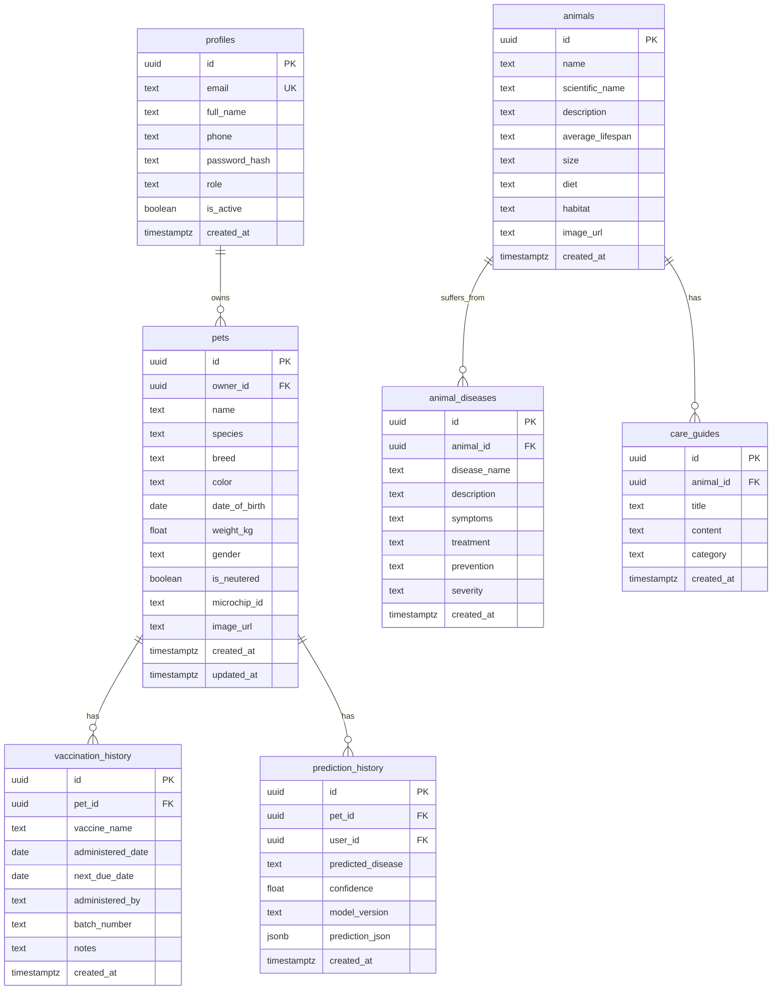
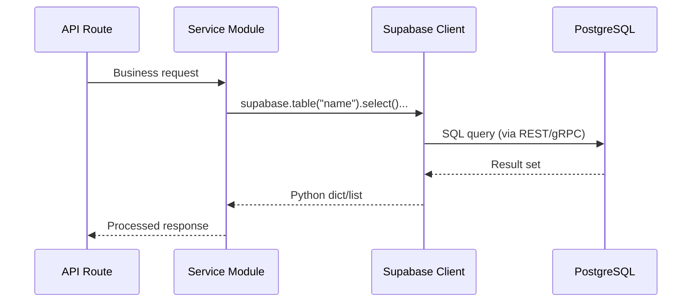

# VetiCare Database Design

## Technology

VetiCare uses **Supabase** (hosted PostgreSQL) as its primary database. The Supabase Python client is used from the FastAPI backend for all database operations. The schema is defined in `supabase_migration.sql`.

---

## Entity-Relationship Diagram



---

## Table Specifications

### `profiles`

Stores registered user accounts. Passwords are hashed with bcrypt before storage.

| Column | Type | Constraints | Description |
|--------|------|-------------|-------------|
| `id` | `uuid` | PK, default `gen_random_uuid()` | Unique identifier |
| `email` | `text` | UNIQUE, NOT NULL | User email (used for login) |
| `full_name` | `text` | NOT NULL | Display name |
| `phone` | `text` | | Contact phone number |
| `password_hash` | `text` | NOT NULL | bcrypt hash of password |
| `role` | `text` | DEFAULT 'user' | Authorization role |
| `is_active` | `boolean` | DEFAULT true | Soft-delete flag |
| `created_at` | `timestamptz` | DEFAULT now() | Account creation timestamp |

### `pets`

Stores user-owned pets with medical metadata.

| Column | Type | Constraints | Description |
|--------|------|-------------|-------------|
| `id` | `uuid` | PK | Unique identifier |
| `owner_id` | `uuid` | FK -> profiles.id | Owning user |
| `name` | `text` | NOT NULL | Pet name |
| `species` | `text` | NOT NULL | Species (Dog, Cat, etc.) |
| `breed` | `text` | | Breed name |
| `color` | `text` | | Primary color/markings |
| `date_of_birth` | `date` | | Birth date |
| `weight_kg` | `float` | | Current weight |
| `gender` | `text` | | Male / Female |
| `is_neutered` | `boolean` | DEFAULT false | Spay/neuter status |
| `microchip_id` | `text` | | Microchip number |
| `image_url` | `text` | | Profile photo URL |
| `created_at` | `timestamptz` | DEFAULT now() | Record creation time |
| `updated_at` | `timestamptz` | DEFAULT now() | Last update time |

### `vaccination_history`

Records each vaccination administered to a pet.

| Column | Type | Constraints | Description |
|--------|------|-------------|-------------|
| `id` | `uuid` | PK | Unique identifier |
| `pet_id` | `uuid` | FK -> pets.id | Vaccinated pet |
| `vaccine_name` | `text` | NOT NULL | Vaccine product name |
| `administered_date` | `date` | NOT NULL | Date given |
| `next_due_date` | `date` | | Next booster date |
| `administered_by` | `text` | | Veterinarian or clinic |
| `batch_number` | `text` | | Manufacturer batch/lot |
| `notes` | `text` | | Additional notes |
| `created_at` | `timestamptz` | DEFAULT now() | Record creation time |

### `prediction_history`

Stores ML disease prediction results.

| Column | Type | Constraints | Description |
|--------|------|-------------|-------------|
| `id` | `uuid` | PK | Unique identifier |
| `pet_id` | `uuid` | FK -> pets.id | Subject pet |
| `user_id` | `uuid` | FK -> profiles.id | User who ran prediction |
| `predicted_disease` | `text` | NOT NULL | Top disease prediction |
| `confidence` | `float` | NOT NULL | Model confidence score |
| `model_version` | `text` | | Model identifier |
| `prediction_json` | `jsonb` | | Full prediction data |
| `created_at` | `timestamptz` | DEFAULT now() | Prediction timestamp |

### `animals`

Reference data for animal species (populated by seed scripts).

| Column | Type | Constraints | Description |
|--------|------|-------------|-------------|
| `id` | `uuid` | PK | Unique identifier |
| `name` | `text` | NOT NULL | Common name |
| `scientific_name` | `text` | | Scientific classification |
| `description` | `text` | | General description |
| `average_lifespan` | `text` | | Typical lifespan range |
| `size` | `text` | | Size category |
| `diet` | `text` | | Dietary information |
| `habitat` | `text` | | Natural habitat |
| `image_url` | `text` | | Image URL |
| `created_at` | `timestamptz` | DEFAULT now() | |

### `animal_diseases`

Reference data for diseases per animal species.

| Column | Type | Constraints | Description |
|--------|------|-------------|-------------|
| `id` | `uuid` | PK | Unique identifier |
| `animal_id` | `uuid` | FK -> animals.id | Affected species |
| `disease_name` | `text` | NOT NULL | Disease name |
| `description` | `text` | | Disease description |
| `symptoms` | `text` | | Common symptoms |
| `treatment` | `text` | | Treatment information |
| `prevention` | `text` | | Prevention measures |
| `severity` | `text` | | Severity level |
| `created_at` | `timestamptz` | DEFAULT now() | |

### `care_guides`

Care instructions and guides per animal species.

| Column | Type | Constraints | Description |
|--------|------|-------------|-------------|
| `id` | `uuid` | PK | Unique identifier |
| `animal_id` | `uuid` | FK -> animals.id | Target species |
| `title` | `text` | NOT NULL | Guide title |
| `content` | `text` | NOT NULL | Full guide content |
| `category` | `text` | | Guide category |
| `created_at` | `timestamptz` | DEFAULT now() | |

---

## Database Access Pattern



The backend never writes raw SQL. All queries go through the Supabase Python client which provides a fluent query builder:

```python
# Example: Get pet with owner validation
result = supabase.table("pets")\
    .select("*")\
    .eq("id", pet_id)\
    .eq("owner_id", owner_id)\
    .execute()
```

---

## Fallback Strategy

The `prediction_history` table implements a dual-insert strategy for schema migration safety. The service attempts a full insert first; if it fails (pre-migration missing columns), it falls back to only inserting columns known to exist:

```python
_KNOWN_COLUMNS = {"id", "pet_id", "predicted_disease", "confidence",
                  "model_version", "prediction_json", "created_at"}

try:
    result = supabase.table("prediction_history").insert(payload).execute()
except APIError:
    safe = {k: v for k, v in payload.items() if k in _KNOWN_COLUMNS}
    result = supabase.table("prediction_history").insert(safe).execute()
```

---

## Migration File

The schema is defined in `supabase_migration.sql` (`veticare/backend/supabase_migration.sql`) and includes:

- `CREATE TABLE` statements for all tables
- UUID primary keys with `gen_random_uuid()`
- Foreign key constraints
- Default values and timestamps
- Unique constraints on email
