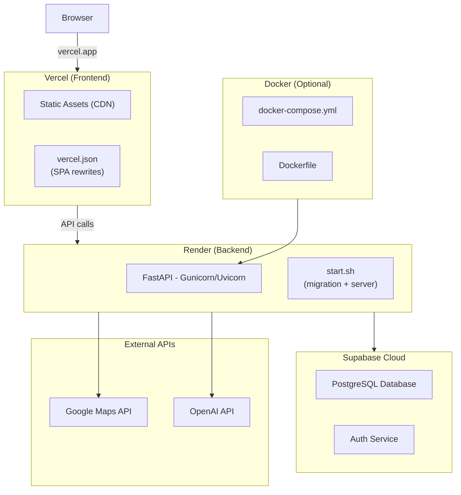

# VetiCare Deployment Guide

## Deployment Architecture



---

## Frontend Deployment (Vercel)

### Configuration

The frontend is deployed to Vercel with a SPA rewrite rule in `vercel.json`:

```json
{
  "rewrites": [{ "source": "/(.*)", "destination": "/index.html" }]
}
```

This ensures all routes (like `/dashboard`, `/pets`) serve `index.html` for the React SPA.

### Build Command

```bash
npm run build  # tsc -b && vite build
```

### Environment Variables

Set in Vercel dashboard:

| Variable | Value |
|----------|-------|
| `VITE_API_URL` | `https://veticare-backend.onrender.com` |
| `VITE_AI_API_URL` | `https://veticare-ai.onrender.com` |

---

## Backend Deployment (Render)

### Start Script

`backend/start.sh`:

```bash
#!/bin/bash
alembic upgrade head
uvicorn app.main:app --host 0.0.0.0 --port $PORT
```

### Runtime Requirements

- **Python**: 3.11+
- **Build**: `pip install -r requirements.txt`
- **Start**: `bash start.sh`

### Environment Variables

Set in Render dashboard:

| Variable | Required | Description |
|----------|----------|-------------|
| `VETICARE_SUPABASE_URL` | Yes | Supabase project URL |
| `VETICARE_SUPABASE_KEY` | Yes | Supabase service_role key |
| `JWT_SECRET_KEY` | Yes (prod) | Secure random string |
| `ENVIRONMENT` | No | `production` |
| `DEBUG` | No | `false` |

---

## Docker Deployment

### Dockerfile

Located at `veticare/Dockerfile`. Builds both backend and frontend in a multi-stage build.

### Docker Compose

`veticare/docker-compose.yml` orchestrates the full stack:

```yaml
services:
  backend:
    build: ./backend
    ports:
      - "8000:8000"
    env_file: ./backend/.env
    volumes:
      - ./backend:/app
    command: uvicorn app.main:app --host 0.0.0.0 --port 8000 --reload
```

---

## Database (Supabase)

Schema is managed via `supabase_migration.sql`. Run the SQL in the Supabase SQL editor or via the Supabase CLI:

```bash
supabase db push
```

---

## Environment Variable Reference

### Frontend (`veticare/frontend/.env.example`)

```bash
VITE_API_URL=http://localhost:8000
VITE_AI_API_URL=http://localhost:8000
```

### Backend (`veticare/backend/.env.example`)

```bash
VETICARE_SUPABASE_URL=your_supabase_project_url
VETICARE_SUPABASE_KEY=your_supabase_service_role_key
JWT_SECRET_KEY=your_secure_jwt_secret
ENVIRONMENT=development
DEBUG=true
CORS_ORIGINS=["http://localhost:5173","http://localhost:3000"]
```

---

## CI/CD Pipeline (GitHub Actions)

```yaml
# .github/workflows/ci.yml
name: CI
on: [push, pull_request]
jobs:
  test:
    runs-on: ubuntu-latest
    steps:
      - uses: actions/checkout@v4
      - name: Set up Python
        uses: actions/setup-python@v5
        with:
          python-version: "3.11"
      - name: Install dependencies
        run: pip install -r requirements.txt
      - name: Run tests
        run: pytest
```

---

## Production Checklist

- [ ] Change `JWT_SECRET_KEY` to a secure random value
- [ ] Set `ENVIRONMENT=production`
- [ ] Set `DEBUG=false`
- [ ] Verify CORS_ORIGINS includes only the Vercel deployment URL
- [ ] Enable TrustedHostMiddleware (auto in production)
- [ ] Run database migrations
- [ ] Verify Supabase connection
- [ ] Deploy ML model (`Random1.joblib`) with backend
- [ ] Set up custom domain (optional)
- [ ] Configure logging destination
