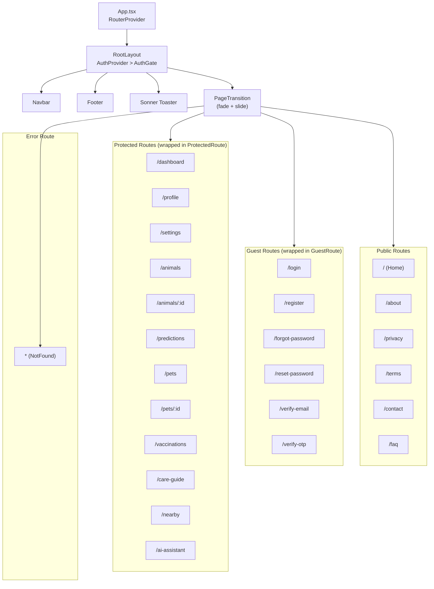
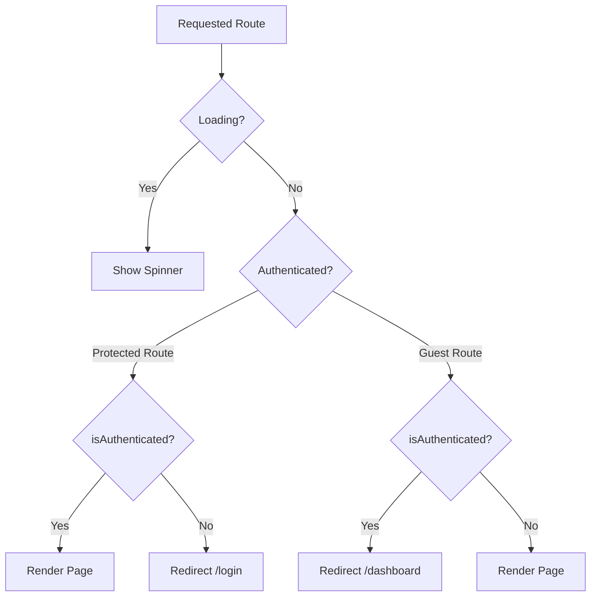
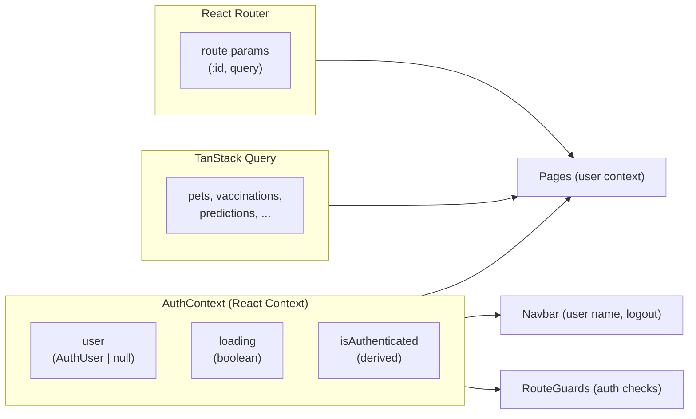

# VetiCare Frontend Architecture

## Overview

The frontend is a **single-page application (SPA)** built with **React 18**, **TypeScript**, and **Vite**. It uses client-side routing (React Router v6), server-state caching (TanStack Query), and utility-first styling (Tailwind CSS).

---

## Technology Stack

| Technology | Version | Purpose |
|------------|---------|---------|
| React | 18.3 | UI library |
| TypeScript | 5.5 | Type safety |
| Vite | 5.4 | Build tool & dev server |
| React Router | 6.24 | Client-side routing |
| TanStack Query | 5.101 | Server state management |
| Tailwind CSS | 3.4 | Utility-first styling |
| Lucide React | 0.407 | Icon library |
| Leaflet | 1.9 | Map rendering |
| React Leaflet | 4.2 | React bindings for Leaflet |
| Sonner | 2.0 | Toast notifications |
| clsx | 2.1 | Conditional classnames |
| tailwind-merge | 2.4 | Class conflict resolution |

---

## Folder Structure

```
src/
├── components/
│   ├── ai-assistant/     # AI chat UI components
│   ├── animal/           # Animal reference components
│   ├── auth/             # AuthCard, RouteGuards
│   ├── layout/           # Navbar, Footer, Section, Container
│   ├── map/              # LocationSearch, MapView
│   └── ui/               # Primitives: Button, Card, Badge, Skeleton, motion, etc.
├── context/
│   └── AuthContext.tsx    # Authentication state management
├── data/
│   └── animals.ts        # Static animal reference data
├── hooks/
│   ├── use-mount-animation.ts   # Page entry animations
│   └── use-reduced-motion.ts     # prefers-reduced-motion hook
├── lib/
│   ├── api.ts            # HTTP client (fetch wrapper)
│   ├── constants.ts      # Animation constants (duration, easing)
│   └── utils.ts          # cn() utility (clsx + tailwind-merge)
├── pages/                # 24 route page components
├── services/
│   ├── auth.ts           # Auth service (login, register, token mgmt)
│   └── services.ts       # API service functions
├── App.tsx               # Root component + routing
├── main.tsx              # Entry point
└── index.css             # Tailwind directives + keyframes + reduced-motion
```

---

## Routing Architecture



### Route Protection Logic



---

## State Management

### Three-Layer State Architecture



### AuthContext API

| Property | Type | Description |
|----------|------|-------------|
| `user` | `AuthUser \| null` | Current user or null |
| `loading` | `boolean` | Session validation in progress |
| `isAuthenticated` | `boolean` | `user !== null && !loading` |
| `login(input)` | `Promise<void>` | Authenticate and store session |
| `register(input)` | `Promise<void>` | Create account and login |
| `logout()` | `Promise<void>` | Clear session, redirect to login |
| `restoreSession()` | `Promise<void>` | Validate stored token on startup |
| `refreshUser()` | `Promise<void>` | Re-fetch `/auth/me` and update state |

---

## Component Library

### UI Primitives (`src/components/ui/`)

| Component | Description |
|-----------|-------------|
| `Button` | Styled button with loading spinner and variants |
| `Card`, `CardHeader`, `CardTitle`, `CardContent`, `CardDescription` | Card layout components |
| `Badge` | Status/count badge |
| `Skeleton`, `SkeletonCard` | Loading placeholder components |
| `Input` | Styled text input |
| `Table` | Styled data table |
| `EmptyState` | Empty state with icon, message, and action |
| `ErrorState` | Error state with retry button |
| `ToggleSwitch` | Boolean toggle control |
| `PageTransition` | Route change animation wrapper |

### Animation System (`src/components/ui/motion.tsx`)

| Component | Description |
|-----------|-------------|
| `FadeIn` | Opacity + optional translateY on mount |
| `StaggerGroup` / `StaggerItem` | Staggered entrance animations for lists |
| `Stagger` | Simple array-based stagger |
| `HoverCard` | Card that lifts on hover (scale + translateY) |
| `HoverButton` | Button that scales on hover/active |
| `SuccessCheckmark` | Animated success checkmark with spring easing |

All animations respect `prefers-reduced-motion` via the `useReducedMotion` hook.

---

## Key Pages

| Page | Route | Description |
|------|-------|-------------|
| Home | `/` | Landing page with hero, features, trust, how-it-works |
| Dashboard | `/dashboard` | User overview: stats, pets, upcoming vaccinations |
| DiseasePrediction | `/predictions` | Select species, input symptoms, run ML prediction |
| Pets | `/pets` | CRUD pet management |
| Vaccinations | `/vaccinations` | Vaccination tracking and scheduling |
| AIVeterinaryAssistant | `/ai-assistant` | LLM-powered symptom assessment |
| NearbyServices | `/nearby` | Google Maps integration for finding vets |
| CareGuide | `/care-guide` | Browse care guides by species |
| Profile | `/profile` | User profile management |
| Settings | `/settings` | Account settings |
| Animals | `/animals` | Animal reference encyclopedia |
| About | `/about` | About page |
| Contact | `/contact` | Contact form |
| FAQ | `/faq` | Frequently asked questions |

---

## Performance Optimizations

### Code Splitting

All page components use `React.lazy()` for dynamic imports. Vite automatically code-splits at the page level:

```typescript
const Dashboard = lazy(() => import("@/pages/Dashboard"));
const DiseasePrediction = lazy(() => import("@/pages/DiseasePrediction"));
```

### Skeleton Loading

Each route group renders a `SkeletonCard` placeholder while lazy chunks load:

```tsx
<Suspense fallback={<PageFallback />}>
  <AnimatedOutlet />
</Suspense>
```

### Animation Performance

- Only `transform` and `opacity` are animated (GPU-composited)
- Durations: 180-300ms, easing: ease-out
- `will-change-transform` on hover-targeted elements
- `useReducedMotion` hook disables all animations when `prefers-reduced-motion: reduce` is active

### Build Output

- Production build produces ~324KB JS (gzipped: ~102KB) + ~65KB CSS (gzipped: ~15KB)
- Individual page chunks range from 0.3KB to 170KB

---

## Error Boundary

`ErrorBoundary.tsx` wraps page content and catches unhandled React errors, displaying a user-friendly error message with a retry button instead of a white screen.

---

## Scroll Management

`ScrollToTop.tsx` scrolls the window to the top on every route change, preventing the browser's default scroll-restoration behavior.
