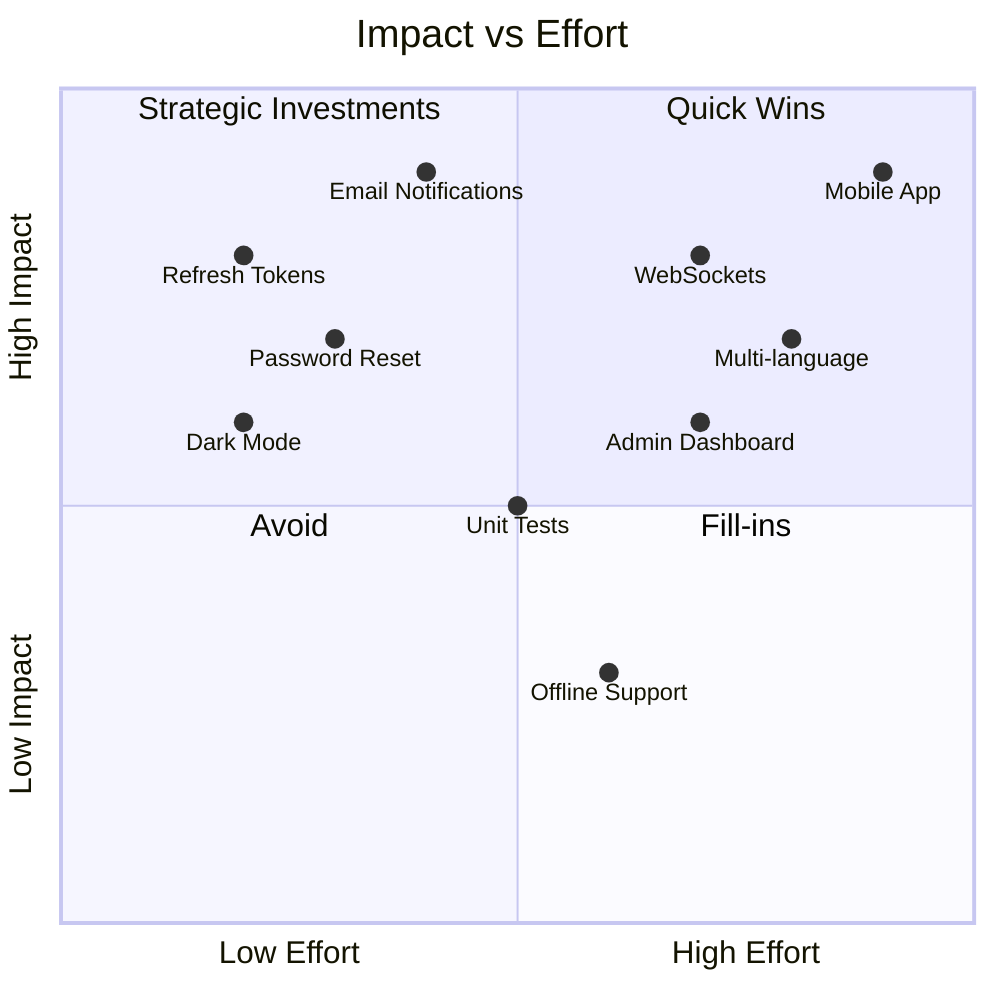
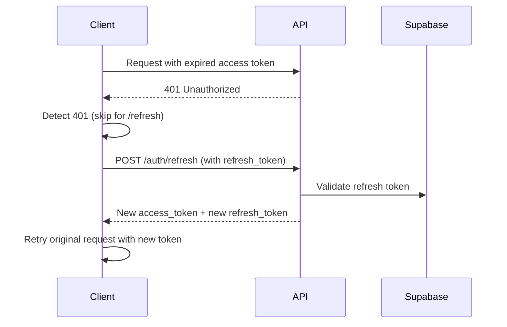
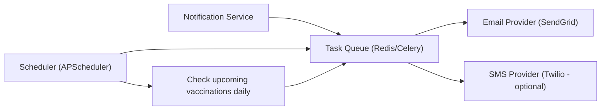

# VetiCare Future Improvements

## Priority Matrix

---

## 1. Refresh Token Implementation

### Problem
JWT tokens expire after 30 minutes with no way to refresh. The user must log in again after expiry.

### Solution
Implement a refresh token flow:
- **Access Token**: Short-lived (15 minutes)
- **Refresh Token**: Long-lived (7 days), stored in httpOnly cookie
- Backend endpoint: `POST /api/v1/auth/refresh`
- Frontend automatically refreshes access token before expiry

---

## 2. Full Password Reset Flow

### Current State
`forgotPassword()`, `resetPassword()`, and `verifyOTP()` return `501 Not Implemented`.

### Required Implementation
- `POST /api/v1/auth/forgot-password`: Send password reset email
- `POST /api/v1/auth/reset-password`: Accept reset token + new password
- Email service integration (SendGrid, AWS SES, or Resend)
- Rate limiting on password reset requests

---

## 3. Email Notifications

### Use Cases
- Vaccination reminders (when `next_due_date` approaches)
- Prediction follow-ups
- Password reset emails
- Email verification

### Architecture

---

## 4. Dark Mode

### Implementation
- CSS variables for theming (already partially using CSS custom properties in `index.css`)
- Theme toggle with `localStorage` persistence
- Respect `prefers-color-scheme` system preference
- Smooth transition between themes

---

## 5. Mobile Application

### Options
- **Progressive Web App (PWA)**: Add service worker, manifest, offline support
- **React Native**: Full native experience with shared TypeScript types
- **Capacitor**: Wrap existing web app in native shell

---

## 6. Admin Dashboard

### Features
- User management (view, disable, delete)
- Content management (animal data, care guides)
- System health monitoring
- Analytics dashboard (user growth, prediction volume)
- ML model performance metrics

---

## 7. Testing Infrastructure

### Current State
The backend has test files in `backend/tests/` (2 tests: `test_read.py`, `test_prediction.py`), but comprehensive test coverage is missing.

### Required Coverage
- **Backend Tests**: Unit tests for services, integration tests for API routes
- **Frontend Tests**: Component tests with Vitest + React Testing Library
- **E2E Tests**: Playwright or Cypress for critical user flows
- **ML Tests**: Model accuracy validation, input edge cases

---

## 8. WebSocket Real-time Updates

### Use Cases
- Live vaccination reminders
- Real-time AI assistant responses (streaming)
- Collaborative pet management

---

## 9. Performance Improvements

### Backend
- **Response caching**: Cache species/symptoms list (infrequently changes)
- **Connection pooling**: Optimize Supabase client pool size
- **Query optimization**: Add composite indexes for frequent queries

### Frontend
- **Image optimization**: Lazy load images with blur placeholder
- **Virtual scrolling**: For large lists (vaccination history)
- **Preloading**: Prefetch most likely next page chunks

---

## 10. Multi-language Support

### Implementation
- `react-i18next` for internationalization
- Dynamic language switching
- Language preference stored in `localStorage`
- Initial support for: English, Spanish, French, German

---

## 11. CI/CD Enhancements

- **Continuous Deployment**: Auto-deploy on merge to main
- **Preview Deployments**: Deploy PR branches to preview URLs
- **Docker Optimization**: Multi-stage builds with caching
- **Monitoring**: Sentry or DataDog for error tracking

---

## 12. Data Export

- Export pet records as PDF
- Download vaccination history as CSV
- Share prediction results via link

---

## 13. Accessibility (a11y) Audit

- Full keyboard navigation
- Screen reader announcements for dynamic content
- Color contrast checking
- Focus management in modals and forms
- ARIA labels on interactive elements

---

## 14. API Versioning

Current API uses `/api/v1/` prefix. Future versions should:
- Support `/api/v2/` for breaking changes
- Maintain backward compatibility
- Document migration guides
- Sunset policy for deprecated endpoints

---

## 15. Rate Limiting Enhancements

- Move from in-memory to Redis-backed rate limiting
- Different rate limits per endpoint (stricter for auth)
- Rate limit headers in responses (`X-RateLimit-Remaining`)
- Rate limit status endpoint for clients
