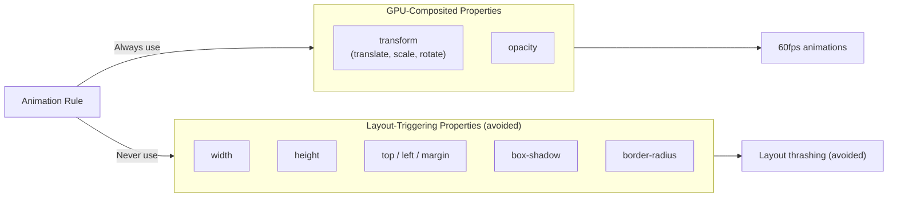
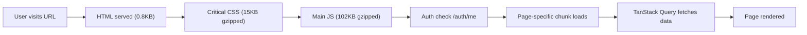

# VetiCare Performance Optimizations

## Frontend Performance

### Code Splitting

All 24 page components use `React.lazy()` for dynamic imports, enabling Vite to automatically split the JavaScript bundle at the page level:

```typescript
const Dashboard = lazy(() => import("@/pages/Dashboard"));
const DiseasePrediction = lazy(() => import("@/pages/DiseasePrediction"));
```

**Production build output**:
- Main bundle: ~324KB JS (gzipped: ~102KB)
- CSS: ~65KB (gzipped: ~15KB)
- Individual page chunks: 0.3KB to 170KB

### Skeleton Loading

Each route group displays skeleton placeholders while lazy chunks load:

```tsx
<Suspense fallback={<PageFallback />}>
  <AnimatedOutlet />
</Suspense>
```

The `PageFallback` component renders:
- A `SkeletonCard` placeholder for the main content area
- A grid of 4 skeleton boxes for list content
- Uses the `skeleton-shimmer` CSS animation

### Animation Performance



All animation components enforce this rule:

```typescript
// Good - only transforms opacity + transform
style={{
  opacity: visible ? 1 : 0,
  transform: visible ? "translateY(0)" : `translateY(${y}px)`,
  transition: `opacity ${duration}ms ease-out, transform ${duration}ms ease-out`,
}}
```

Animation durations are constrained to **180-300ms** with **ease-out** easing for natural-feeling motion.

### Accessibility: Reduced Motion

The `useReducedMotion` hook syncs with `prefers-reduced-motion: reduce`:

```typescript
// Listens for OS-level motion preference
const reduced = useReducedMotion();
if (reduced) return <div>{children}</div>; // No animation wrapper
```

The CSS also disables animations at the global level:

```css
@media (prefers-reduced-motion: reduce) {
  .animate-fade-in,
  .animate-slide-up,
  .skeleton-shimmer {
    animation: none !important;
    opacity: 1 !important;
  }
  *, *::before, *::after {
    animation-duration: 0.01ms !important;
    transition-duration: 0.01ms !important;
  }
}
```

### TanStack Query Caching

Server state is cached with sensible defaults:

```typescript
const queryClient = new QueryClient({
  defaultOptions: {
    queries: {
      retry: 1,              // One retry on failure
      staleTime: 30_000,     // 30 seconds before re-fetch
      refetchOnWindowFocus: false,  // No background refetch on tab switch
    },
  },
});
```

### Build Tooling

- **Vite**: Fast dev server with HMR (Hot Module Replacement)
- **TypeScript**: Static type checking eliminates entire classes of runtime errors
- **Tailwind CSS**: Utility-first CSS with automatic purging of unused styles in production
- **ESBuild** (via Vite): Fast JavaScript/TypeScript transpilation

---

## Backend Performance

### Middleware Ordering

The middleware stack is arranged for minimal overhead:

1. **RateLimitMiddleware**: Fast in-memory check (rejects early for abusive clients)
2. **RequestLogMiddleware**: Wraps the entire request (logs before and after)
3. **CORSMiddleware**: Adds response headers (no request processing required)

### ML Model Optimization

- Model is loaded **once** at startup into `app.state.model`
- Prediction runs **in-process** — no network calls for inference
- Uses `pandas` DataFrame for vectorized feature transformation
- scikit-learn `Pipeline` ensures consistent preprocessing

### Database Query Patterns

- All queries use Supabase's indexed columns (`id`, `owner_id`, `pet_id`)
- Filtering is done server-side (not fetching all rows and filtering in Python)
- Pagination via `.range(offset, offset + limit - 1)`
- Column selection with `.select("specific_columns")` to reduce payload size

### Concurrency

- FastAPI uses **async** request handling (uvicorn with ASGI)
- Database calls are synchronous (Supabase Python client) but wrapped in async endpoints
- Rate limiting is per-IP with O(1) lookup

---

## Load Time Optimization



### Initial Load Sequence

1. `index.html` (~0.8KB) loads
2. Critical CSS loads (inlined via Vite)
3. Main JS bundle loads (324KB, gzipped to 102KB)
4. AuthContext checks token existence and optionally calls `/auth/me`
5. Page-specific chunk loads via `React.lazy()`
6. TanStack Query fetches page data
7. Skeleton placeholders are replaced with live content
