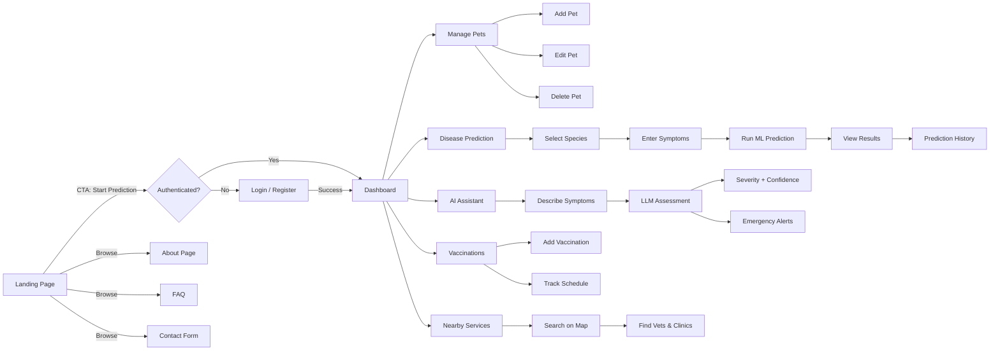
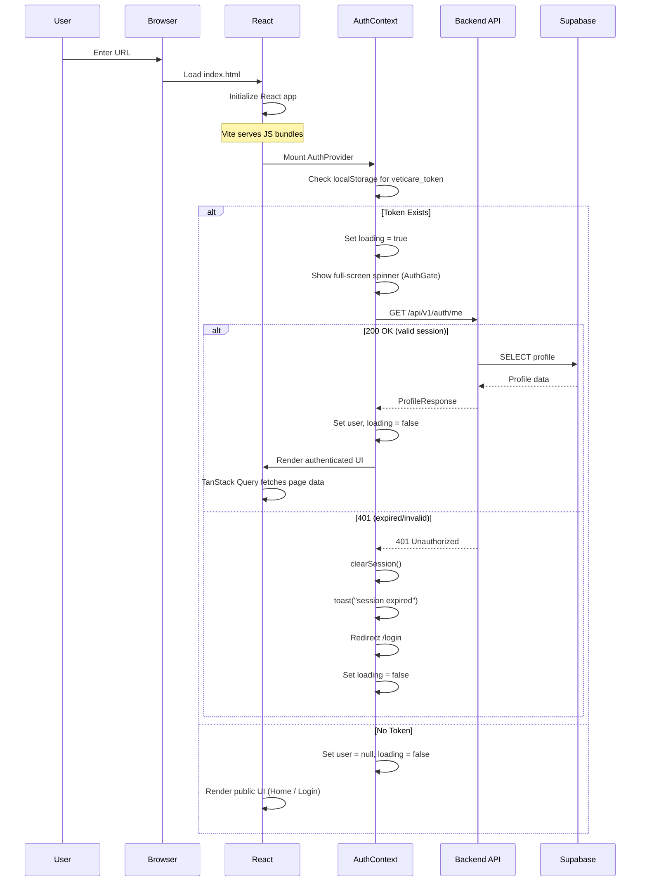
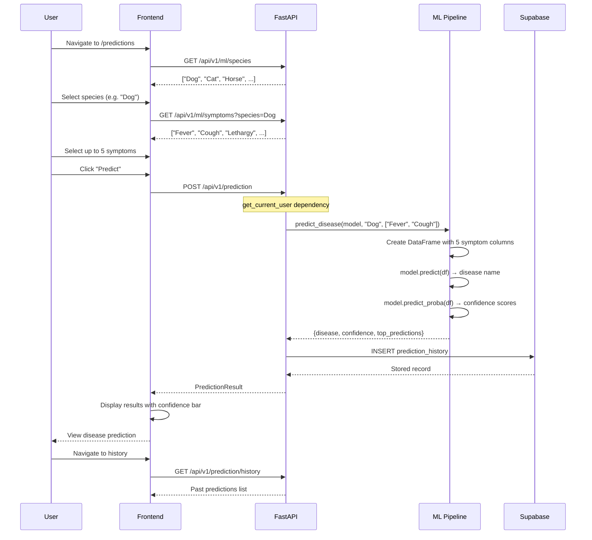
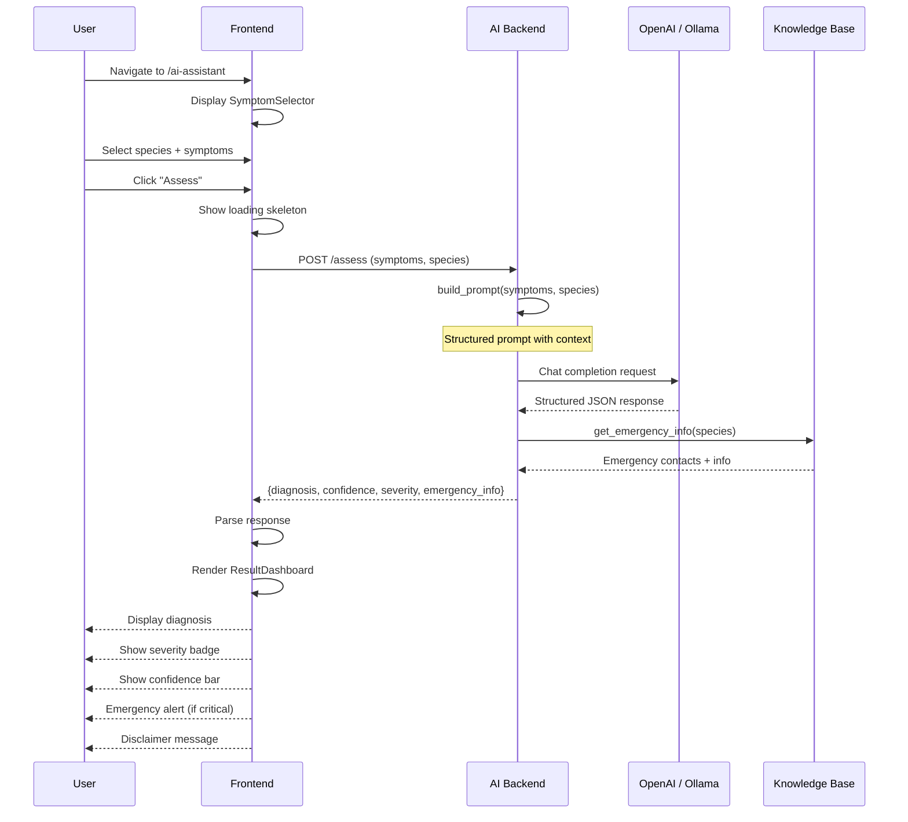
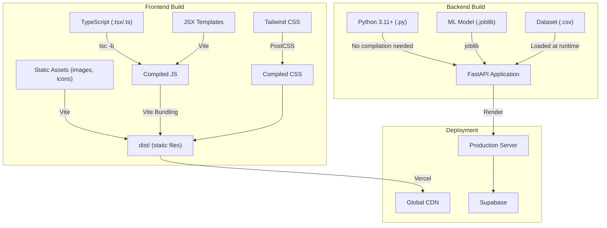
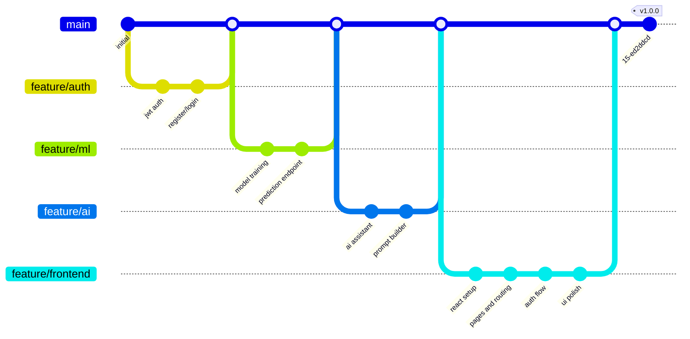

# VetiCare Project Flow

## User Journey

---

## Application Startup Flow

---

## Disease Prediction Flow

---

## AI Assistant Flow

---

## Project Build Flow

---

## Project Life Cycle

### Development Cycle

