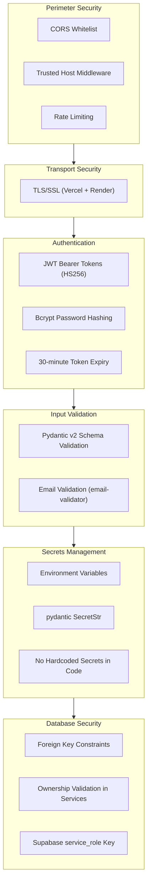

# VetiCare Security Architecture

## Security Layers



---

## Authentication

### JWT Token Security

| Property | Implementation |
|----------|---------------|
| Algorithm | HS256 (HMAC with SHA-256) |
| Key Length | Arbitrary (set via `JWT_SECRET_KEY`) |
| Payload | `sub` (profile UUID), `exp` (expiry), `iat` (issued at) |
| Expiry | 30 minutes (configurable via `ACCESS_TOKEN_EXPIRE_MINUTES`) |
| Validation | Every request verifies signature, expiry, and profile existence in DB |

Tokens are created and validated in `app/utils/security.py`:

```python
def create_access_token(subject: str) -> str:
    expires_at = datetime.now(UTC) + timedelta(minutes=settings.access_token_expire_minutes)
    return jwt.encode(
        {"sub": subject, "exp": expires_at, "iat": datetime.now(UTC)},
        settings.jwt_secret_key.get_secret_value(),
        algorithm=settings.jwt_algorithm,
    )
```

### Production Secret Validation

At startup, the application validates that `JWT_SECRET_KEY` is not set to the development default in production:

```python
@model_validator(mode="after")
def validate_production_secrets(self) -> "Settings":
    if (
        self.environment == "production"
        and self.jwt_secret_key.get_secret_value() == "development-only-change-me"
    ):
        raise ValueError("JWT_SECRET_KEY must be set to a secure value in production")
```

---

## Password Security

### Hashing

- **Algorithm**: bcrypt via `passlib[bcrypt]`
- **Salt**: Auto-generated per password (`gensalt()`)
- **Storage**: `password_hash` column in `profiles` table

```python
def hash_password(password: str) -> str:
    return _bcrypt.hashpw(password.encode("utf-8"), _bcrypt.gensalt()).decode("utf-8")

def verify_password(password: str, hashed_password: str) -> bool:
    try:
        return _bcrypt.checkpw(password.encode("utf-8"), hashed_password.encode("utf-8"))
    except ValueError:
        return False
```

### Request Body Masking

The `RequestLogMiddleware` masks password fields in logged request bodies:

```python
def _safe_body(body: bytes) -> str:
    obj = json.loads(body)
    if isinstance(obj, dict):
        obj = {k: ("****" if "password" in k.lower() else v) for k, v in obj.items()}
    return json.dumps(obj)
```

---

## Input Validation

All API inputs are validated by **Pydantic v2** schemas:

```python
class RegisterRequest(BaseModel):
    email: EmailStr         # Validated by email-validator
    password: str = Field(min_length=8)
    full_name: str = Field(min_length=1, max_length=100)
    phone: str | None = None
```

Invalid requests receive a **422 Unprocessable Entity** response with field-level error details. This prevents injection attacks and malformed data from reaching business logic.

---

## Authorization

### Ownership Validation

Every pet/vaccination/prediction operation validates that the resource belongs to the authenticated user:

```python
def get_pet_by_id(supabase: Client, pet_id: uuid.UUID, owner_id: uuid.UUID) -> dict:
    result = supabase.table("pets").select("*")\
        .eq("id", str(pet_id))\
        .eq("owner_id", str(owner_id))\
        .execute()
    if not result.data:
        raise HTTPException(status_code=404)
    return result.data[0]
```

---

## Rate Limiting

The `RateLimitMiddleware` (`app/core/rate_limit.py`) implements a **token bucket algorithm**:

- Per-client-IP buckets
- Configurable refill rate and capacity
- Prevents brute-force attacks on auth endpoints
- Returns `429 Too Many Requests` when exhausted

---

## CORS Protection

Only whitelisted origins can make browser requests:

| Environment | Allowed Origins |
|-------------|----------------|
| Development | `http://localhost:3000`, `http://localhost:5173`, `http://127.0.0.1:3000`, `http://127.0.0.1:5173` |
| Production | `https://veticare-seven.vercel.app` |

---

## Secrets Management

- All secrets are configured via **environment variables**
- JWT secret is stored as `pydantic.SecretStr` (not logged or exposed in error responses)
- Development defaults are clearly marked and rejected in production
- `.env` files are in `.gitignore` — never committed

---

## Global Error Handler

Catches unhandled exceptions and returns sanitized responses without leaking stack traces:

```python
@application.exception_handler(Exception)
async def global_exception_handler(request: Request, exc: Exception):
    trace_id = str(uuid.uuid4())
    logger.exception("trace_id=%s unhandled exception", trace_id)
    return JSONResponse(
        status_code=500,
        content={
            "success": False,
            "message": "Internal server error",
            "trace_id": trace_id,
        },
    )
```

The `trace_id` is logged server-side for debugging but never exposes implementation details to the client.
