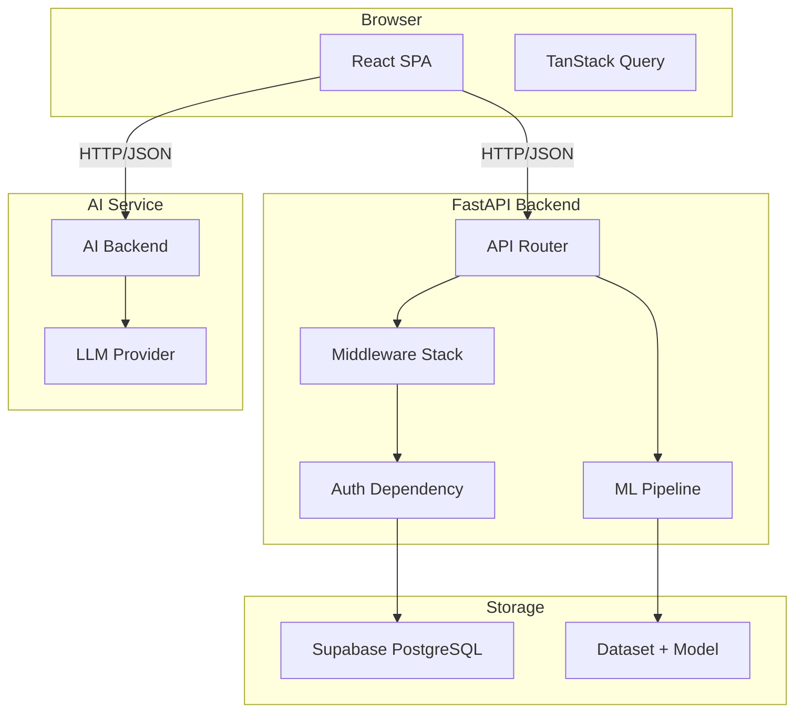
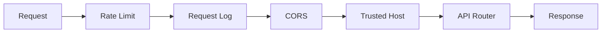

# Architecture

## System Overview

VetiCare follows a **decoupled architecture** with a React SPA frontend communicating with a FastAPI REST backend over HTTP/JSON. The backend connects to Supabase (PostgreSQL) for data persistence and integrates with external APIs for maps and AI.

## Architecture Diagram

## Key Design Decisions

### Why FastAPI?
- **Performance**: ASGI-based, comparable to Node.js/Go
- **Validation**: Built-in Pydantic integration for request/response validation
- **Documentation**: Auto-generated OpenAPI/Swagger docs
- **Dependency Injection**: Clean separation of concerns via `Depends()`

### Why React + TypeScript?
- **Type Safety**: Catches errors at compile time
- **Component Model**: Reusable UI primitives
- **Ecosystem**: Rich library support (TanStack Query, React Router)

### Why Supabase?
- **Managed PostgreSQL**: No database administration overhead
- **Scalability**: Handles growth without infrastructure changes
- **Security**: Row-level security policies

### Why Client-side ML vs API-based?
- **Latency**: In-process predictions in <10ms
- **Simplicity**: No separate ML serving infrastructure
- **Cost**: No per-prediction API costs

## Middleware Pipeline

## Module Interactions

See [Backend](Backend) for detailed module descriptions and [Frontend](Frontend) for the component hierarchy.
