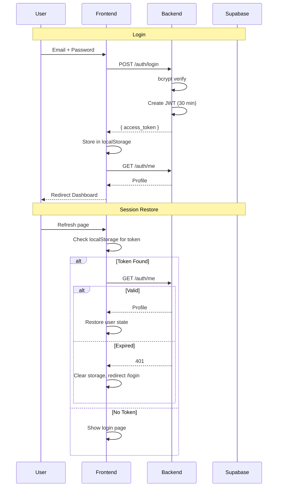

# Authentication

## Overview

VetiCare uses **stateless JWT authentication**. The backend issues signed tokens, and the frontend validates sessions on every startup by calling `/auth/me`. The backend is the **single source of truth**.

## Flow Diagram

## Implementation

### Backend: JWT Creation (`app/utils/security.py`)
- Algorithm: HS256
- Expiry: 30 minutes
- Payload: `{ sub: profile_id, exp, iat }`

### Backend: Auth Dependency (`app/api/dependencies.py`)
- Decodes JWT, extracts profile_id
- Queries Supabase for active profile
- Returns profile or raises 401

### Frontend: AuthContext (`src/context/AuthContext.tsx`)
- Exposes: `user`, `loading`, `isAuthenticated`, `login()`, `logout()`, `restoreSession()`, `refreshUser()`
- Registers global 401 handler with `api.ts`
- Shows full-screen spinner during session validation

### Frontend: Route Guards (`src/components/auth/RouteGuards.tsx`)
- `ProtectedRoute`: Redirects to `/login` if not authenticated
- `GuestRoute`: Redirects to `/dashboard` if already authenticated

## Security

- Passwords hashed with bcrypt (never stored in plain text)
- JWT secret must be changed from default in production
- Production startup rejects development default secret
- All 401 responses globally clear auth state
- Request logging masks password fields

## Source Code

- `veticare/backend/app/utils/security.py` — JWT + bcrypt
- `veticare/backend/app/api/dependencies.py` — Auth dependency
- `veticare/frontend/src/context/AuthContext.tsx` — Auth state
- `veticare/frontend/src/services/auth.ts` — Auth service
- `veticare/frontend/src/lib/api.ts` — HTTP client with 401 interceptor
