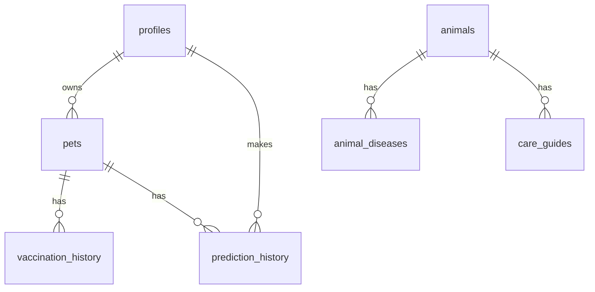

# Database

## Technology

VetiCare uses **Supabase** (hosted PostgreSQL) as its database. The schema is defined in `veticare/backend/supabase_migration.sql`.

## Entity Relationship Diagram

## Tables

### `profiles`
User accounts. Passwords are bcrypt-hashed.

| Column | Type | Notes |
|--------|------|-------|
| id | uuid | PK, auto-generated |
| email | text | UNIQUE, used for login |
| full_name | text | Display name |
| phone | text | Contact number |
| password_hash | text | bcrypt hash |
| role | text | Default: "user" |
| is_active | boolean | Soft-delete flag |
| created_at | timestamptz | Auto timestamp |

### `pets`
User-owned pets.

| Column | Type | Notes |
|--------|------|-------|
| id | uuid | PK |
| owner_id | uuid | FK → profiles.id |
| name | text | Pet name |
| species | text | Dog, Cat, etc. |
| breed | text | Breed name |
| date_of_birth | date | Birth date |
| weight_kg | float | Current weight |
| gender | text | Male/Female |
| is_neutered | boolean | Spay/neuter status |

### `vaccination_history`
Vaccination records per pet.

| Column | Type | Notes |
|--------|------|-------|
| id | uuid | PK |
| pet_id | uuid | FK → pets.id |
| vaccine_name | text | Vaccine product name |
| administered_date | date | Date given |
| next_due_date | date | Booster date |
| administered_by | text | Veterinarian |

### `prediction_history`
ML prediction results.

| Column | Type | Notes |
|--------|------|-------|
| id | uuid | PK |
| pet_id | uuid | FK → pets.id |
| user_id | uuid | FK → profiles.id |
| predicted_disease | text | Top prediction |
| confidence | float | Model confidence |
| prediction_json | jsonb | Full prediction data |

## Source Code

- **Schema**: `veticare/backend/supabase_migration.sql`
- **Client**: `veticare/backend/app/core/supabase.py`
- **Services**: `veticare/backend/app/services/` (per-table service modules)
