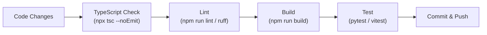

# Developer Guide

## Development Workflow



## Backend Development

### Adding a New API Route

1. Create schema in `app/schemas/`
2. Create service in `app/services/`
3. Create route in `app/api/routes/`
4. Register route in `app/api/router.py`

### Adding a New Database Table

1. Add `CREATE TABLE` to `supabase_migration.sql`
2. Create service functions in `app/services/`
3. Create Pydantic schemas in `app/schemas/`
4. Create CRUD routes in `app/api/routes/`

### Testing

```bash
cd backend
pytest                    # Run all tests
pytest -v                 # Verbose
pytest tests/test_auth.py # Single file
```

## Frontend Development

### Adding a New Page

1. Create component in `src/pages/`
2. Add lazy import in `src/App.tsx`
3. Add route in the appropriate group (public/guest/protected)

### Adding a New API Call

1. Add function in `src/services/services.ts`
2. Use `api.get/post/patch/delete` from `src/lib/api.ts`
3. Call from component with TanStack Query's `useQuery`/`useMutation`

### Animation Guidelines

- Use components from `src/components/ui/motion.tsx`
- Only animate `transform` and `opacity`
- Keep durations in 180-300ms range
- Use `useReducedMotion()` hook for accessibility
- Use `DURATION` and `EASING` constants from `src/lib/constants.ts`

## Environment Variables

Do not commit `.env` files. Use `.env.example` as a template.

## Monitoring

- Backend logs appear in stdout (JSON format)
- Logfire provides structured logging
- Global exception handler generates `trace_id` for debugging
